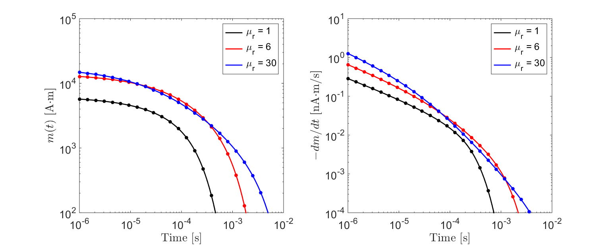

.. _SphereTEM_analytic_derivation:

Analytic Derivation
===================

.. Purpose::

	Here, analytic expressions for the impulse response and step-off excitation for a conductive and magnetically permeable sphere are derived.
	These derivations follow the ones found in Wait (:cite:`Wait1951`) and Wait and Spies (:cite:`WaitSpies1969`).
 

Introduction
------------

According to Wait and Spies (:cite:`WaitSpies1969`), the induced dipole moment :math:`m(t)` characterizing a sphere's time-dependent electromagnetic excitation is defined by a convolution:

.. math::
	m(t) = \Bigg ( \frac{4\pi}{3} R^3 \Bigg ) \int_{-\infty}^\infty \chi (\tau) h_0 (t-\tau )d\tau
	:label: eqDipoleMomentConvStepOff
	
where :math:`R` is the sphere's radius, :math:`\chi (t)` represents the sphere's impulse response and :math:`h_0 (t)` represents the inducing field.
By definition, :math:`\chi (t)` is the inverse Fourier transform of the sphere's frequency-dependent :ref:`excitation factor<sphereFEM_excitation_factor>` (:cite:`Wait1951`):

.. math::
	\chi (t) = \frac{1}{2\pi} \int_{-\infty}^{\infty} \chi (i \omega) e^{i\omega t} d\omega
        :label: eqInverseFourierGenDef
        
However, if a change of variables is used (:math:`s = i\omega`), then Eq. :eq:`eqInverseFourierGenDef` can be more generally expressed as an inverse Laplace transform:

.. math::
	\chi (t) = \frac{1}{2 \pi i} \int_{c - i\infty}^{c + i\infty} \chi (s) e^{st} ds = \mathcal{L}^{-1} \big [ \chi (s) \big ]
	:label: LaplaceIFT

where :math:`\chi (s)` is the sphere's excitation factor parameterized in terms of a variable :math:`s`.
A small positive constant :math:`c` is chosen so that the contour path of integration lies within the convergence region of :math:`\chi (s)`.
Here, our derivations begin with frequency-domain expressions for the sphere's excitation factor according to Wait (:cite:`Wait1951`).
Next, solutions using the inverse Laplace transform are derived according to Wait and Spies (:cite:`WaitSpies1969`). 

Purely Conductive Sphere
------------------------

Here, we derive the unit-step excitation and the impulse response for a conductive and non-permeable (:math:`\mu = \mu_0`) sphere.
In this case, the frequency-dependent excitation factor :math:`\chi (i\omega)` for the sphere is defined by (:cite:`Wait1951`):

.. math::
	\chi (i\omega) = - \; \frac{3}{2} \Bigg [ 1 + \frac{3}{\alpha^2} - \frac{3 \, \textrm{coth} (\alpha)}{\alpha} \Bigg ]
	:label: ChiConductive

where:

.. math::
	\alpha = \Big [ i \omega \mu_0 \sigma \Big ]^{1/2} R \; ,
	:label: alpha

:math:`R` is the radius of the sphere, :math:`\sigma` is the conductivity of the sphere and :math:`\mu_0 = 4 \times 10^{-7}` H/m is the permeability of free-space.

Impulse Response
++++++++++++++++

To obtain the excitation factor's impulse response, Wait and Spies (:cite:`WaitSpies1969`) employed a change of variables on Eq. :eq:`ChiConductive`.
By replacing :math:`s=i\omega`, letting :math:`\beta=(\mu_0 \sigma)^{1/2} R` and re-expressing the hyperbolic cotanjent as an infinite series, Eq. :eq:`ChiConductive` becomes:

.. math::
	\begin{align}
	\chi (s)&= - \; \frac{3}{2} \Bigg [ 1 + \frac{3}{\beta^2 s} - \frac{3 \, \textrm{coth} (\beta s^{1/2} )}{\beta s^{1/2}} \Bigg ] \\
		&= - \; \frac{3}{2} \Bigg [ 1 + \frac{3}{\beta^2 s} + \frac{3}{\beta s^{1/2}} \Bigg ( \frac{1 + e^{-2 \beta s^{1/2} } }{1 -  e^{-2 \beta s^{1/2}}} \Bigg ) \Bigg ] \\
		&= - \; \frac{3}{2} \Bigg [ 1 + \frac{3}{\beta^2 s} - \frac{3}{\beta s^{1/2}} - \frac{6}{\beta} \sum_{n = 1}^\infty \frac{e^{-2n \beta s^{1/2}}}{s^{1/2}} \Bigg ]
	\end{align}
	:label: ChiChangeVar

For each of the terms within Eq :eq:`ChiChangeVar`, the inverse Laplace transform is now trivial and can be looked up in tables.
As a result, the solution to Eq. :eq:`LaplaceIFT` is given by:

.. math::
	\chi (t) = - \; \frac{3}{2} \delta (t) - \frac{9}{2} \Bigg [ \frac{1}{\beta^2} - \frac{1}{\beta \sqrt{\pi t}} \Bigg ( 1 + 2 \sum_{n = 1}^\infty e^{-(n\beta)^2/t} \Bigg ) \Bigg ] u(t)
	:label: ImpulseConductive

where :math:`\delta(t)` is the Dirac delta function.
We can see that Eq. :eq:`ImpulseConductive` is zero for :math:`t<0`, implying it is causal.
It should be noted that our expression for :math:`\chi (t)` differs from the one in Wait and Spies (:cite:`WaitSpies1969`) by a factor of :math:`-3/2`.
This is because of how we chose to define :math:`\chi (i\omega)`.
Although the impulse response is written as an infinite series, exponential terms become negligible when the product of :math:`(n\beta)^2t` is sufficiently large.
As a result, only a finite portion of the sum is required to approximate the response to a reasonable degree of accuracy; with more terms being required at early times.

Step Response
++++++++++++++++

Consider the sphere's response to step-excitation.
At time :math:`t=0`, an inducing field of amplitude :math:`H_0` excites the sphere.
The inducing field can be expressed as:

.. math::
	h_0 (t) = H_0 u(t)
	:label: StepOn

Using Eqs. :eq:`ImpulseConductive` and :eq:`StepOn` to solve Eq. :eq:`eqDipoleMomentConvStepOff`:

.. math::
	m(t) = \frac{4\pi}{3}R^3 \Bigg [ \int_{-\infty}^{\infty} \chi (\tau) H_0 u(t-\tau) d\tau \Bigg ] = \frac{4\pi}{3}R^3 \Bigg [ \int_0^t \chi (\tau) d\tau \Bigg ] H_0
	:label: ConvolutionStep

The convolution in Eq. :eq:`ConvolutionStep` only requires integration of the impulse response from 0 to :math:`t`.
By substituting Eq. :eq:`ChiConductive` into Eq :eq:`ConvolutionStep`, we can obtain the final expression presented in Wait and Spies (:cite:`WaitSpies1969`):

.. math::
	\int_0^t \chi (t) d\tau = - \; \frac{9}{2} \Bigg [ \frac{1}{3} + \frac{t}{\beta^2} - \frac{2}{\beta} \sqrt{\dfrac{t}{\pi}} \Bigg ( 1 + 2 \sum_{n=1}^\infty e^{-(n\beta)^2/t} \Bigg ) + 4 \sum_{n=1}^\infty n \; \textrm{erfc}\Bigg ( \frac{n\beta}{\sqrt{t}} \Bigg ) \Bigg ] u(t)
	:label: IntImpulse0t

where :math:`\textrm{erfc}(z)` is the complimentary error function given by:

.. math::
	\textrm{erfc}(z) = \frac{2}{\sqrt{\pi}} \int_z^\infty e^{-t^2} dt
	:label: erfc
	
Although a rigorous proof will not be provided here, Eq. :eq:`IntImpulse0t` goes to 0 as :math:`t` goes to infinity.
Thus:

.. math::
	\lim_{t\rightarrow\infty} \; \int_0^t \chi (\tau) d\tau = 0
	:label: IntImpulseLimit
	
This is expected given that inductive responses decay to zero after sufficient time.
The response to step-off excitation may be obtained by replacing the waveform in Eq. :eq:`ConvolutionStep`.
This results in the following expression:

.. math::
	m(t) = \frac{4\pi}{3}R^3 \Bigg [ \int_{-\infty}^{\infty} \chi (\tau) H_0 \big [ 1 - u(t-\tau) \big ] d\tau \Bigg ] = - \; \frac{4\pi}{3}R^3 \Bigg [ \int_0^t \chi (\tau) d\tau \Bigg ] H_0
	:label: ConvolutionStepOff
	
Comparing Eqs. :eq:`ConvolutionStep` and :eq:`ConvolutionStepOff`, the response to step-on and step-off excitation behave identically and have opposing sign.
The rate of decay for the step-off response is obtained by taking the derivative of Eq. :eq:`ConvolutionStepOff` with respect to :math:`t`:

.. math::
	\begin{align}
	\frac{d \, m(t)}{dt} &= \frac{4\pi}{3}R^3 \Bigg [ \int_{-\infty}^{\infty} \chi (\tau) \frac{d \, h_0 (t-\tau)}{dt} d\tau \Bigg ] \\
			     &= \frac{4\pi}{3}R^3 \Bigg [ - \; \int_{-\infty}^{\infty} \chi (\tau) \, H_0 \, \delta (t-\tau) d\tau \Bigg ] \\
			     &= - \; \frac{4\pi}{3}R^3 \, \chi (t) \, H_0
	\end{align}
	:label: dmdtStepOff

Therefore, the rate of decay may be obtained directly if the excitation's impulse response is known.
The unit step-off response for a sphere of radius :math:`R` = 10 m, for several conductivities, is shown in :numref:`TransientConductive2`.

.. figure:: ./images/figTransientConductive.png
        :width: 98%
        :name: TransientConductive2

	Transient response for a non-permeable sphere for several conductivities.

Response from a Conductive and Magnetically Permeable Sphere in a Resistive Medium
----------------------------------------------------------------------------------

Here we consider the time-dependent magnetization of a conductive and magnetically permeable sphere within a resistive medium (:math:`\sigma_b \ll \sigma`).
Expressions for the step-on response, step-off response, rate of decay, and impulse response are presented.
In this case, the frequency-dependent excitation of the sphere is defined by:

.. math::
	\chi (i\omega) = \frac{3}{2} \Bigg [ \frac{2\mu (\mathrm{tanh} \, \alpha - \alpha) + \mu_0 (\alpha^2 \, \mathrm{tanh} \, \alpha - \alpha + \mathrm{tanh} \, \alpha)}{\mu (\mathrm{tanh} \, \alpha - \alpha) - \mu_0 (\alpha^2 \, \mathrm{tanh} \, \alpha - \alpha + \mathrm{tanh} \, \alpha)} \Bigg ]
	:label: ChiPermeable

where, if electric displacement is neglected (i.e. :math:`\omega \varepsilon \ll \sigma`):

.. math::
	\alpha = \Big [ i \omega \mu \sigma \Big ]^{1/2} R
	:label: alphaPermeable

Once again, step and impulse responses for the conductive and magnetically permeable sphere can be derived using the inverse Laplace transform (:cite:`WaitSpies1969`).
The inverse Laplace transforms can be solved using the pole-residue theorem.
As this derivation is somewhat more technical, only the final results from Wait and Spies are provided here.

Step Response
+++++++++++++

For a conductive and magnetically permeable sphere, it is easier to begin by presented expressions for the step response.
According to Eqs. :eq:`eqDipoleMomentConvStepOff` and :eq:`LaplaceIFT`, the time-dependent excitation of the sphere can be expressed as:

.. math::
	m(t) = \frac{4\pi}{3}R^3 \mathcal{L}^{-1} \big [ \chi(s) H_0 (s) \big ]
	:label: mStepILTpermeable
	
where :math:`H_0 (s)` is the Laplace transform of :math:`h_0 (t)`.
For a step-on excitation:

.. math::
	\mathcal{L}^{-1} \big [ \chi(s) H_0 (s) \big ] = \frac{H_0}{2\pi i} \int_{c-i\infty}^{c+i\infty} \frac{\chi (s)}{s} e^{st} ds
	:label: mStepILTpermeable2

where :math:`H_0` is the amplitude of the step waveform and :math:`H_0 (s) = H_0/s`.
By solving the inverse Laplace transform, the time-dependent response to step excitation is given by (:cite:`WaitSpies1969`):

.. math::
	m(t) = \frac{4\pi}{3}R^3 \, H_0 \Bigg [ \frac{3}{2} \Bigg ( \frac{2 (\mu_r - 1)}{\mu_r + 2} - 6\mu_r \, \sum_{n=1}^\infty \frac{ e^{-\xi_n^2 t/\beta^2}}{(\mu_r + 2)(\mu_r - 1)+\xi_n^2} \Bigg ) \Bigg ] u(t)
	:label: mStepOnPermeable

where :math:`\mu_r = \mu/\mu_0` is the relative permeability, and :math:`\xi_n` are defined according to poles of the inverse Laplace transform.
These poles behave according to the following expression:

.. math::
	\textrm{tan} \, \xi_n = \frac{(\mu_r - 1) \xi_n}{\mu_r - 1 + \xi_n^2}
	:label: Coefficients

From Wait and Spies (:cite:`WaitSpies1969`), coefficients :math:`\xi_n` are spaced roughly :math:`\pi` apart with:

.. math::
	n\pi \leq \xi_n \leq (n+1/2)\pi
	:label: CoeffIntervals

The value of each coefficient may be found iteratively using very few iterations (:math:`<10`) according to:

.. math::
	\xi_n^{(k+1)} = n\pi + \mathrm{tan}^{-1} \Bigg ( \frac{(\mu_r - 1)\xi_n^{(k)}}{\mu_r - 1 + \big ( \xi_n^{(k)} \big )^2}  \Bigg )
	:label: CoeffIteration

The response described by Eq :eq:`mStepOnPermeable` contains two terms.
The first term represents the sphere's magnetic response.
This may be obtained by setting :math:`\omega \rightarrow 0` in Eq. :eq:`ChiPermeable`.
The second term represents the sphere's inductive response.
The inductive response is a sum of modes which decrease in magnitude as :math:`n \rightarrow \infty`.
Thus, only a finite portion of the sum is required to approximate the sphere's inductive response, with more terms being required at earlier times.

For a step-off response, the field is magnetized at :math:`t<0`.
Once the inducing field is removed, only the inductive response is non-zero.
Using Eq. :eq:`mStepOnPermeable`, the step-off excitation is:

.. math::
	m(t) = \frac{4\pi}{3}R^3 \, H_0 \Bigg [ \frac{3}{2} \Bigg ( \frac{2 (\mu_r - 1)}{\mu_r + 2} \big [ 1 - u(t) \big ] + 6 \mu_r \, \sum_{n=1}^\infty \frac{ e^{- \, \xi_n^2 t/\beta^2}}{(\mu_r + 2)(\mu_r - 1)+\xi_n^2} u(t) \Bigg ) \Bigg ]
	:label: mStepOffPermeable

The rate of decay at time :math:`t>0` can be obtained by taking the time-derivative of Eq. :eq:`mStepOffPermeable`:

.. math::
	\frac{d \, m(t)}{dt} = - \, \frac{4\pi}{3}R^3 \, H_0 \Bigg [ 9\mu_r \, \sum_{n=1}^\infty \frac{ \xi_n^2 \, e^{- \, \xi_n^2 t/\beta^2}}{\beta^2 \big [ (\mu_r + 2)(\mu_r - 1)+\xi_n^2 \big ]} \Bigg ] u(t)
	:label: dmdtStepOffPermeable
	
The unit step-off response for a sphere of radius :math:`R` = 10 m and conductivity :math:`\sigma` = 10 S/m, for several relative permeabilities, is shown in :numref:`TransientPermeable2`.

        Transient response from a conductive and permeable sphere for several relative permeabilities.

Impulse Response
++++++++++++++++

The impulse response for a conductive and magnetically permeable sphere can be obtained by the following properties of the convolution:

.. math::
	\chi (t) = \frac{d}{dt} \Big [ \chi (t) \otimes u(t) \Big ] = \frac{d}{dt} \mathcal{L}^{-1} \Bigg [ \frac{\chi(s)}{s} \Bigg ]
	:label: ImpulsePermeable3

The above inverse Laplace transform was solved to obtain the step-on response in Eq :eq:`mStepOnPermeable`, thus:

.. math::
	\begin{align}
	\chi (t) &= \frac{d}{dt} \Bigg [ \frac{3}{2} \Bigg ( \frac{2 (\mu_r - 1)}{\mu_r + 2} - 6\mu_r \, \sum_{n=1}^\infty \frac{ e^{-\xi_n^2 t/\beta^2}}{(\mu_r + 2)(\mu_r - 1)+\xi_n^2} \Bigg ) u(t) \Bigg ]\\
			&= Q \, \delta (t) + \, \frac{3}{2} \Bigg ( \frac{6 \mu_r}{\beta^2} \sum_{n=1}^\infty \frac{ \xi_n^2 \, e^{-\xi_n^2 t/\beta^2}}{(\mu_r + 2)(\mu_r - 1)+\xi_n^2} \Bigg ) u(t)
	\end{align}
	:label: ImpulsePermeableInital

where

.. math::
	Q = \frac{3}{2} \Bigg ( \frac{2 (\mu_r - 1)}{\mu_r + 2} - 6\mu_r \, \sum_{n=1}^\infty \frac{ 1 }{(\mu_r + 2)(\mu_r - 1)+\xi_n^2} \Bigg )
	:label: Qdef

:math:`Q` happens to be the convolution of :math:`\chi (t)` and :math:`u(t)`, evalutated at :math:`t=0`.
This can be checked using Eq. :eq:`mStepOnPermeable`.
By the initial value theorem of the Laplace transform:

.. math::
	Q = \big [\chi (t) \otimes u(t) \big ] \Big |_{t=0} = \lim_{s \rightarrow \infty} \chi(s) = - \, \frac{3}{2}
	:label: Qsolve

Therefore, the impulse response for a conductive and permeable sphere is:

.. math::
	\chi (t) = - \, \frac{3}{2} \delta (t) + \, \frac{3}{2} \Bigg ( \frac{6 \mu_r}{\beta^2} \sum_{n=1}^\infty \frac{ \xi_n^2 \, e^{-\xi_n^2 t/\beta^2}}{(\mu_r + 2)(\mu_r - 1)+\xi_n^2} \Bigg ) u(t)
	:label: ImpulsePermeableFinal

