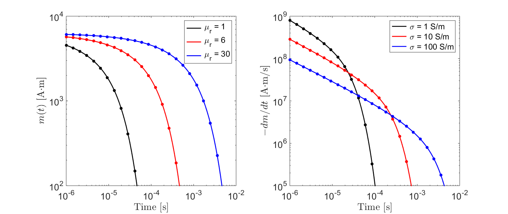
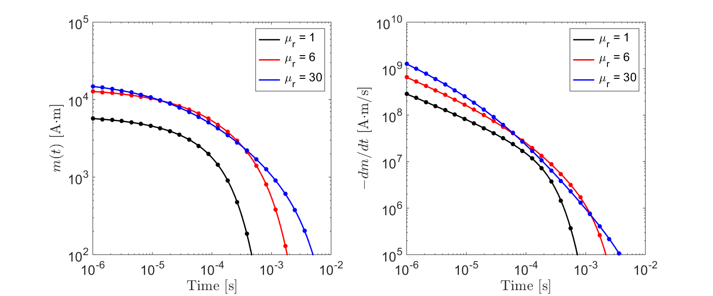

.. _SphereTEM_transient_response:

Transient Response
==================

.. Purpose::

	The transient response of an object defines its step-off excitation; that is, the response by an object once a static field is removed.
	Here, we analyze the sphere's transient response in terms of the induced magnetic dipole moment.
	The dependence of the transient response on the sphere's physical properties are examined for permeable and non-permeable spheres.

Introduction
------------

The field :math:`h_0(t)` which induces a transient response from the sphere can be described using the following expression:

.. math::
	h_0 (t) = H_0 u(-t)
	:label: eqStepOffGenDef

where :math:`u(t)` is the unit-step function and :math:`H_0` is the amplitude of the applied field at :math:`t\leq 0`.
From the previous section, the induced magnetic moment :math:`m(t)` characterizing the sphere is defined by a convolution:

.. math::
	m(t) = \Bigg ( \frac{4\pi}{3} R^3 \Bigg ) \int_{-\infty}^\infty \chi (\tau) h (t-\tau )d\tau
	:label: eqDipoleMomentConvStepOffTransient

where :math:`\chi (t)` represents the excitation's impulse response.
By substituting Eq. :eq:`eqStepOffGenDef` into Eq. :eq:`eqDipoleMomentConvStepOffTransient` we obtain the following:

.. math::
	m(t) = \Bigg ( \frac{4\pi}{3} R^3 \Bigg ) \Bigg ( \int_{t}^\infty \chi (\tau) d\tau \Bigg ) H_0
	:label: eqDipoleMomentConvStepOffTransient2

From Eq. :eq:`eqDipoleMomentConvStepOffTransient2`, the sphere's transient response is linearly proportional to the strength on the inducing field.
The characteristic behavior of the decay at time :math:`t` is determine by integrating the impulse response from :math:`t` to :math:`\infty`.
Our analysis of the transient response is done by examining analytic solutions to Eq. :eq:`eqDipoleMomentConvStepOffTransient2` for permeable and non-permeable spheres.

Conductive Sphere
-----------------

Here, we consider the transient response from a conductive and non-permeable (:math:`\mu = \mu_0`) sphere.
For a step-off excitation, the induced dipole moment for the sphere is given by:

.. math::
	\begin{split}
	m(t) = \Bigg ( \frac{4\pi}{3}R^3 \Bigg ) \Bigg ( \frac{9}{2} \Bigg ) \Bigg [ \frac{1}{3} + \frac{t}{\beta^2} - \frac{2}{\beta} \sqrt{\frac{t}{\pi}} \Bigg ( 1 + 2 & \sum_{n=1}^\infty e^{-(n \beta)^2/t} \Bigg ) \; ... \\
	&+ 4 \sum_{n=1}^\infty n \, \textrm{erfc} \Bigg ( \frac{n \beta}{\sqrt{t}} \Bigg ) \Bigg ] H_0 \, u(t)
	\end{split}
	:label: eqmStepoffConductive

where:

.. math::
	\beta = (\mu_0 \sigma )^{1/2} R
	:label: eqBetaGenDef2

and erfc(:math:`z`) is the complementary error function given by:

.. math::
	\textrm{erfc}(z) = \frac{2}{\sqrt{\pi}} \int_z^\infty e^{-t^2} dt
	:label: eqComplementaryErrorFcn

According to Eq. :eq:`eqmStepoffConductive`, the sphere does not experience an excitation while the field is applied; as electromagnetic induction is zero.
At :math:`t=0` however, the time-dependent change in the applied magnetic field induces eddy currents within the sphere.
These eddy currents diffuse over time, dependent on the size and conductivity of the sphere.
The strength of the induced current, and thus the strength of the sphere's inductive response, is characterized by the sphere's magnetic dipole moment.

The rate of decay for the sphere's magnetic dipole moment can be obtained by taking the derivative of Eq. :eq:`eqmStepoffConductive`.
For :math:`t>0`:

.. math::
	\frac{d m}{dt} = \Bigg ( \frac{4\pi}{3}R^3 \Bigg ) \Bigg ( \frac{9}{2} \Bigg ) \Bigg [ \frac{1}{\beta^2} - \frac{1}{\beta \sqrt{\pi t}} \Bigg ( 1 + 2 \sum_{n=1}^\infty e^{-(n\beta)^2/t} \Bigg ) \Bigg ] H_0
	:label: eqdmdtStepoffConductive

As an example, let us consider a sphere of radius :math:`R=10` m.
The sphere is subject to a unit step-off excitation; thus :math:`H_0=1`.
In :numref:`TransientConductive`, we show the transient response for several conductivities.
We can see that for low conductivities, the strength of the induced dipole moment decays much more quickly.
Since :math:`\beta` increases as a function of :math:`R` as well as :math:`\sigma`, we expect to observe a similar relationship in terms of the sphere's radius.
Additionally, we see that for early times, the rate of decay is proportional to :math:`t^{-1/2}`.

	Transient response for a non-permeable sphere for several conductivities.

Conductive and Magnetically Permeable Sphere
--------------------------------------------

Here, we consider the transient response from a conductive and non-permeable sphere.
For a step-off excitation, the induced dipole moment for the sphere is given by:

.. math::
	m(t) = \Bigg ( \frac{4\pi}{3}R^3 \Bigg ) \Bigg [ \frac{3}{2} \Bigg ( \frac{2 (\mu_r - 1)}{\mu_r + 2} u(-t) + 6 \mu_r \, \sum_{n=1}^\infty \frac{ e^{- \, \xi_n^2 t/\beta^2}}{(\mu_r + 2)(\mu_r - 1)+\xi_n^2} u(t) \Bigg ) \Bigg ] H_0
	:label: eqmStepoffPermeable

where :math:`\mu_r = \mu/\mu_0` is the relative permeability of the sphere and:

.. math::
	\beta = \big ( \mu \sigma \big )^{1/2} R
	:label: eqBetaGenDefTransient

Coefficients :math:`\xi_n` within the sum are defined by:

.. math::
	\textrm{tan} \, \xi_n = \frac{(\mu_r - 1)\xi_n}{\mu_r - 1 + \xi_n^2}
	:label: eqCoefficientGenDef

From Wait and Spies (:cite:`WaitSpies1969`), these coefficients are spaced roughly :math:`\pi` apart such that:

.. math::
	n\pi \leq \xi_n \leq (n+1/2) \pi
	:label: eqCoefficientSeparation

The value of each coefficient may be found iteratively using very few iterations (< 10) according to:

.. math::
	\xi_n^{(k+1)} = n\pi + \textrm{tan}^{-1}\Bigg ( \frac{(\mu_r - 1) \xi_n^{(k)}}{\mu_r - 1 + (\xi_n^{(k)} )^2} \Bigg )
	:label: eqCoefficientIterative

According to Eq. :eq:`eqmStepoffPermeable`, the sphere's response is separated into two terms; one for :math:`t\leq 0` and one for :math:`t>0`.
The first term, which is non-zero for :math:`t \leq 0`, represents the sphere's steady-state magnetic response.
As we can see from Eq. :eq:`eqmStepoffPermeable`, this response depends only on the sphere's magnetic properties.
A detailed description of the steady-state magnetic response of a permeable sphere can be found :ref:`here<sphereFEM_excitation_factor_static>`.
The induced dipole moment at :math:`t>0` represents the sphere's inductive response.
When comparing Eqs. :eq:`eqmStepoffConductive` and :eq:`eqmStepoffPermeable`, we see that the sphere's transient response now depends on the magnetic permeability.

The rate of decay for the sphere's magnetic dipole moment can be obtained by taking the derivative of Eq. :eq:`eqmStepoffPermeable`.
For :math:`t>0`:

.. math::
	\frac{d m}{dt} = - \, \Bigg ( \frac{4\pi}{3}R^3 \Bigg ) \Bigg [ 9\mu_r \, \sum_{n=1}^\infty \frac{ \xi_n^2 \, e^{- \, \xi_n^2 t/\beta^2}}{\beta^2 \big [ (\mu_r + 2)(\mu_r - 1)+\xi_n^2 \big ]} \Bigg ] H_0
	:label: dmdtStepOffPermeableTransient

As an example, let us consider a sphere of radius :math:`R=10` m.
The sphere is subject to a unit step-off excitation; thus :math:`H_0=1`.
In :numref:`TransientPermeable`, we show the transient response for several relative permeabilities.
For :math:`\mu_r < 6`, the strength of the inductive response increases with respect to the relative permeability but ultimately shows similar behaviour with respect to :math:`t`.
For large relative permeabilities however, the characteristic decay of the induced dipole moment is altered by the sphere's magnetic properties.

        Transient response from a conductive and permeable sphere for several relative permeabilities.

