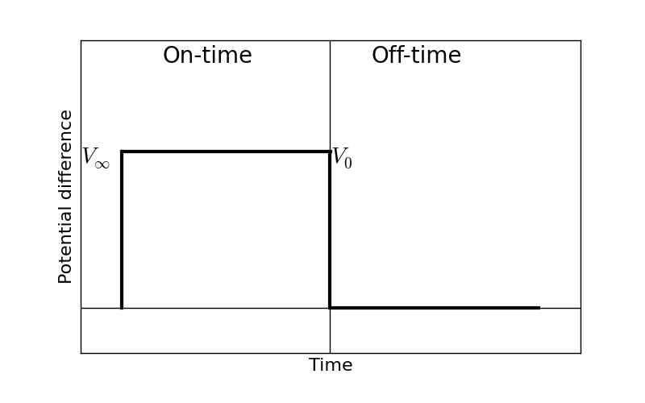

.. _chargeability_units_values:

Units & Values
==============

Units
-----

By definition of the intrinsic chargeability, :math:`\eta = \frac{V_0-V_\infty}{V_0}`, the unit will be V/V (Dimensionless); :math:`\eta` will be bounded to :math:`[0,1)`. The chargeability can be considered as net voltage difference from inifinte to zero frequency normalized by voltage at zero frequency, :math:`V_0`. As shown in below diagram, when the current switched-on in the on-time, polarization charges start to build up (:math:`V_0`) then at a late time it asymptotes to steatdy-state (:math:`V_0`). After the current is switched-off built polarization charge is decaying and asymptotes to zero.

Since we cannot measure exact value of :math:`V_{\infty}` and :math:`V_0`, we often alternatively measure voltage at off-time, :math:`V_s(t)` then integrate in certain range of time to obtain pseudo-chargeability, :math:`M`:

.. math::
	M = \int_{t_1}^{t_2} \frac{V_s(t)}{V_0} dt,

where :math:`t_1` and :math:`t_2` are arbitraty times used for integration. The unit of this pseudo-chareability (M) is often ms.

.. note::
	Depending on the used time window, measured pseudo-chargeability can under- or over-estiamte intrinsic chargeabiility. For instance, if discharging happens within really short time window and our integration time window is on much later time, then the integrated pseudo-charegability could be significantly underestimated. We will treat this later in :ref:`chargeability_mathematical_relationships_measured_voltage`

There can be different types of the pseudo-chargeability:

.. math::
	M = (t_2-t_1)\int_{t_1}^{t_2} \frac{V_s(t)}{V_0} dt,

and its unit is mV/V.

Values
------

The following tables (from Telford et al, 1976) provides a very general guide to possible chargeabilities of materials. One reason that in-situ chargeabilities tend to appear lower than laboratory values is that large volumes of mixed materials are involved in field measurements.

These examples show that a wide range of variability can be expected, implying that it is difficult to use values of intrinsic chargeability (in models obtained by inversion of IP data) to determine exactly what type of rock or material is in the ground. However, this is an ongoing topic of research.

**Table 1:** The values below involved more realistic charging and integration times of 3 seconds and 0.02-1.0 seconds respectively.

+-----------------------+--------------------------+
|  **Material type**    | **Chargeability (msec)** |
+=======================+==========================+
| ground water          | 0                        |
+-----------------------+--------------------------+
| alluvium              | 1-4                      |
+-----------------------+--------------------------+
| gravels               | 3-9                      |
+-----------------------+--------------------------+
| precambrian volcanics | 8-20                     |
+-----------------------+--------------------------+
| precambrian gneisses  | 6-30                     |
+-----------------------+--------------------------+
| schists           	| 5-20                     |
+-----------------------+--------------------------+
| sandstones            | 3-12                     |
+-----------------------+--------------------------+
| argilites             | 3-10                     |
+-----------------------+--------------------------+
| quartzites            | 5-12                     |
+-----------------------+--------------------------+

**Table 2:** Chargeability of minerals at 1% concentration in the samples (charging and integration times as per Table 2 above)

+-----------------------+--------------------------+
|  **Material type**    | **Chargeability (msec)** |
+=======================+==========================+
| pyrite                | 13.4                     |
+-----------------------+--------------------------+
| chalcocite            | 13.2                     |
+-----------------------+--------------------------+
| copper                | 12.3                     |
+-----------------------+--------------------------+
| graphite              | 11.2                     |
+-----------------------+--------------------------+
| chalcopyrite          | 9.4                      |
+-----------------------+--------------------------+
| bornite            	| 6.3                      |
+-----------------------+--------------------------+
| galena                | 3.7                      |
+-----------------------+--------------------------+
| magnetite             | 2.2                      |
+-----------------------+--------------------------+
| malachite             | 0.2                      |
+-----------------------+--------------------------+
| hematite              | 0.0                      |
+-----------------------+--------------------------+

.. .. todo::
..     **@DWO: does this go here, or with lab setup? (or elements in both?** Impedance curve with frequency (:math:`Z(\omega)`); :math:`sigma(\omega)`; definition of eta from the asymptotic values; transforming to time to get time dependent conductivity; over-voltage diagram; using V_inf and :math:`V_0` to theoretically define eta.

.. .. todo::
..     Units: the intrinsic changeability is dimensionless. :math:`[0,1]`. In practice surveys are explicitly designed to find chargeable material and the field data acquire units that correspond to the survey.  In this regard, any datum that is connected with chargeable .

