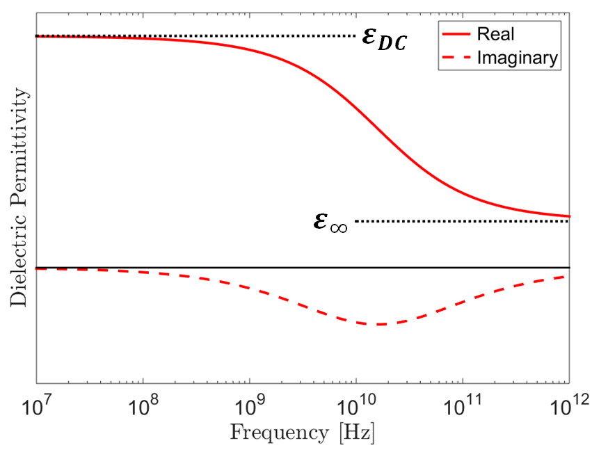

.. _dielectric_permittivity_factors:

Factors that affect electrical permittivity
===========================================

Porosity and Water Saturation
-----------------------------

By far the most important factors in determining a rock's dielectric permittivity are porosity and water saturation.
Air has a relative permittivity of 1 whereas common rock forming minerals have much higher relative permittivities.
This means that for dry samples, the rock's bulk dielectric permittivity decreases as the porosity increases.

When rock samples are saturated with water, their dielectric permittivities can increase drastically.
This is because water has a relative permittivity of 80, which is much higher than the relative permittivities of rock forming minerals.
As a result, the bulk dielectric permittivity of a rock increases as pore water saturation increases.

The relationship between a rock's bulk dielectric permittivity, porosity and water saturation is given by:

.. math::
    \sqrt{\varepsilon} = (1 - \phi ) \sqrt{\varepsilon_m} + \phi \big [ S_w \sqrt{\varepsilon_w} + (1-S_w) \sqrt{\varepsilon_a} \big ]

where

- :math:`0 \leq \phi \leq 1` is the porosity
- :math:`0 \leq S_w \leq 1` is the factional volume of the pore space saturated by water.
- :math:`\varepsilon_m` is the dielectric permittivity of rock forming minerals.
- :math:`\varepsilon_a` is the dielectric permittivity of air (equal to free-space).
- :math:`\varepsilon_w` is the dielectric permittivity of water.

Frequency
---------

For hard rocks and unsaturated sedimentary samples, the dielectric permittivity can be considered constant for all intents and purposes.
At sufficiently low frequencies, the same can be said about water-saturated sedimentary rocks and soils (Kaatze, 1989; Meissner and Wentz, 2004).
At high frequencies however ( > 1 GHz), the electric polarization within water-saturated samples depends on the frequency of the electric field.
As a result, these samples are sometimes characterized using a frequency-dependent dielectric permittivity:

.. math::
    \varepsilon (\omega) = \varepsilon^\prime (\omega) + i \varepsilon^{\prime\prime} (\omega)

where :math:`i = \sqrt{-1}`.
The real component of the dielectric permittivity (:math:`\varepsilon^\prime`) represents energy stored through electrical polarization whereas the imaginary component (:math:`\varepsilon^{\prime\prime}`) represents a measure of energy loss.

A widely used model for describing the frequency-dependent dielectric permittivity is the Cole-Cole model:

.. math::
    \varepsilon (\omega) = \varepsilon_\infty + \frac{\varepsilon_{DC} - \varepsilon_\infty}{1 + (i\omega \tau)^\alpha}

where :math:`\varepsilon_{DC}` is the DC or zero-frequency permittivity, and :math:`\varepsilon_\infty` represents a limit as frequency goes to infinity.
Parameters :math:`\tau` and :math:`\alpha` define the span of frequencies in which the dielectric permittivity changes with respect to frequency.
As we can see from this model:

- Frequency-dependence only occurs over a finite span of frequencies.
- The magnitude of the dielectric permittivity decreases with respect to an increase in frequency.
- At sufficiently low frequencies, the dielectric permittivity is constant and real-valued.

