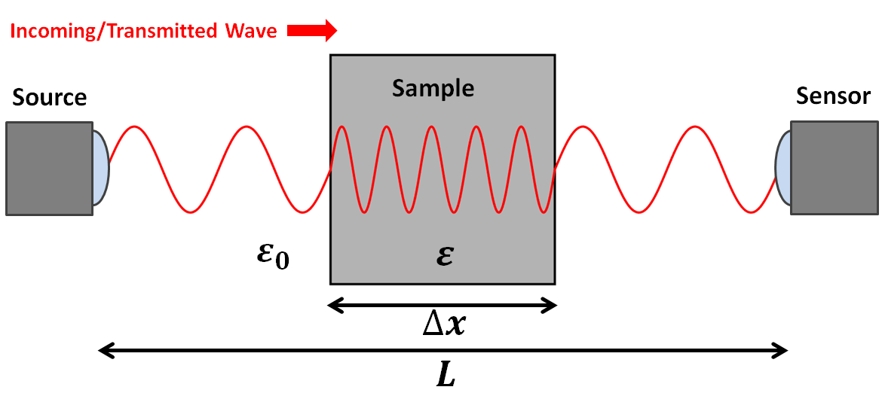
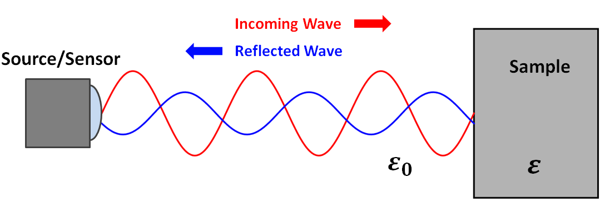

.. _dielectric_permittivity_lab_setup_measurements:

Lab Setup and Measurements
==========================

There are a host of methods for measuring the dielectric permittivity of a material.
Here, we will describe two basic experiments.
These experiments assume that 1) the sample is non-magnetic (i.e. :math:`\mu = \mu_0`) and 2) the conductivity of the sample is sufficiently small (:math:`\sigma < 0.01`).

Transmission Time Measurements
------------------------------

The speed at which high-frequency electromagnetic (EM) waves move through a material depends on the material's dielectric permittivity.
Assuming the material is non-magnetic, this relationship is given by:

.. math::
    v = \frac{c}{\sqrt{\varepsilon_r}}

where :math:`\varepsilon_r` is the relative permittivity and :math:`c = 2.998 \times 10^8` m/s is the speed light constant.
In free-space, :math:`\varepsilon_r = 1` and EM waves travel at the speed of light.
However, within a dielectric material, EM waves propagate more slowly according to the above relationship.

When performing physical property measurements, a source sends EM waves towards a sample.
A portion of these waves transmit through the sample and reach a sensor on the other side.
For samples that have high dielectric permittivities, it will take much longer for the signal to arrive at the sensor.
This is because the transmitted waves slow down as they propagates through the sample.
An equation for the total travel time (:math:`\Delta t`) for transmitted EM waves as the go from the source to the receiver is given by:

.. math::
    \Delta t = \frac{L - \Delta x}{c} + \frac{\Delta x}{v}

where :math:`L` is the distance from the source to the receiver, :math:`\Delta x` is the length of the sample, :math:`c` is the speed of light and :math:`v` is the velocity of the waves as they propagate through the material.
Using the signal measured by the receiver, we can determine the total travel time for the transmitted EM waves.
By combining the previous two equations and solving for the relative permittivity:

.. math::
    \varepsilon_r = \Bigg ( 1 + \frac{c\Delta t - L}{\Delta x} \Bigg )^2

Reflection Coefficient Measurements
-----------------------------------

When EM waves meet an interface, some of their energy is reflected and some of their energy is transmitted.
For high-frequency EM waves, the proportion of energy which is reflected depends on the dielectric properties of the materials comprising the interface.
This relationship is generally characterized by a reflection coefficient.
The reflection coefficient :math:`R` defines the ratio between the amplitude of the reflected wave and the amplitude of the incoming wave:

.. math::
    R = \frac{A_{ref}}{A_{inc}}

Below is a diagram for a simplified experiment.
In this experiment, a source generates EM waves which are reflected due to a difference in dielectric permittivity.
The reflected waves are measured by a sensor.
Assuming the incoming waves have a zero incidence angle relative to the interface, the reflection coefficient is given by:

.. math::
    R = \frac{1 - \sqrt{\varepsilon_r}}{1 + \sqrt{\varepsilon_r}}

where :math:`\varepsilon_r` is the relative permittivity of the sample.
From the source, it is trivial to determine the amplitude of incident EM waves at the interface.
Using the sensor, we may also determine the amplitude of reflected EM waves at the interface.
If both amplitudes are known, the first equation may be used to determine the reflection coefficient.
Once obtained, the second equation may be used to solve for the relative permittivity of the sample.

