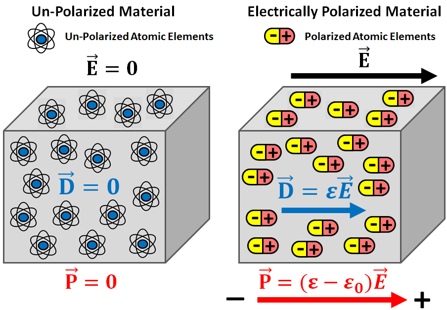

.. _dielectric_permittivity_index:

Dielectric Permittivity
=======================

Dielectric permittivity is an important diagnostic physical property in geophysics. Along with electrical conductivity and magnetic permeability, rocks can be differentiated by their dielectric permittivities. Dielectric permittivity impacts the attenuation, wavelength and velocity of electromagnetic waves as they propagate through a material. This physical is especially important to consider when using ground-penetrating radar.

Formal Definition
-----------------

Dielectric permittivity (:math:`\varepsilon`) is defined as the ratio between the electric field (:math:`\vec E`) within a material and the corresponding electric displacement (:math:`\vec D`):

.. math::
    \vec D = \varepsilon \vec E

When exposed to an electric field, bounded electrical charges of opposing sign will try to separate from one another. For example, the electron clouds of atoms will shift in position relative to their nuclei. The extent of the separation of the electrical charges within a material is represented by the electric polarization (:math:`\vec P`). The electric field, electric displacement and electric polarization are related by the following expression:

.. math::
    \vec D = \varepsilon_0 \vec E + \vec P

where the permittivity of free-space (:math:`\varepsilon_0 = 8.8541878176 \times 10^{-12}` F/m) defines the relationship between :math:`\vec D` and :math:`\vec E` if the material is non-polarizable.
Therefore, the dielectric permittivity and the electric displacement define how strongly a material becomes electrically polarized under the influence of an electric field.

Relative Pemittivity
--------------------

The dielectric properties of materials are generally expressed using the relative permittivity (:math:`\varepsilon_r`).
The relative permittivity defines the dielectric properties of a material relative to that of free-space:

.. math::
    \varepsilon_r = \frac{\varepsilon}{\varepsilon_0}

The relative permittivity is both positive and :math:`\geq 1`. The typical range of values for rocks and other important materials can be found :ref:`here <dielectric_permittivity_values>`.

Dielectric Susceptibility
-------------------------

The electrical polarization within a material can be defined in terms of the electric field as follows:

.. math::
    \vec P = (\varepsilon - \varepsilon_0 ) \vec E = \chi_e \varepsilon_0 \vec E

where :math:`\chi_e` is known as the electric susceptibility. Note that the polarization is always parallel to the electric field. The electric susceptibility should not be confused with the magnetic susceptibility, as they describe different physical processes.

**Contents**

 .. toctree::
    :maxdepth: 1

    dielectric_permittivity_lab_setup_measurements
    dielectric_permittivity_units
    dielectric_permittivity_values
    dielectric_permittivity_factors

