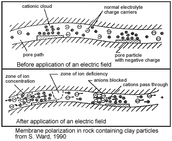

.. _electrical_conductivity_factors:

Factors Impacting Conductivity and Chargeability
================================================

The electrical properties of rocks are influenced by many factors. The most common factors include:

	- Mineralogy (specifically the concentration of metallic particles and clay minerals)
	- Porosity and tortuosity
	- Pore saturation
	- Pore-water salinity

..	- Temperature
..	- Pressure
..	- Grain texture

Factors Impacting Conductivity
------------------------------

Pore-space and Pore-water Properties
^^^^^^^^^^^^^^^^^^^^^^^^^^^^^^^^^^^^

The majority of rock forming minerals are poor conductors. As a result, the conductive properties of most rocks are dominated by ionic conduction. The efficiency of ionic conduction depends on the pore-space and pore-water properties of the rock. In general, rock conductivity is larger when:

	- the salinity (the concentration of dissolved ions) is larger.
	- the porosity and pore saturation are larger
	- the tortuosity is smaller

Recall from an earlier definition, that the ionic conductivity was proportional to the number of charge carriers (:math:`n`), i.e.:

.. math::
	\sigma = e (n^+ \mu_m^+ + n^- \mu_m^-)

where (+) and (-) were used to denote cations and anions, respectively. Therefore as salinity increases, there are more ionic charge carriers. This is responsible for increasing the conductivity of the rock. The number of ionic charge carriers also increases as the pore-space and pore-saturation increase. Pore space allows more of the rock to be comprised of ionic pore-water, as opposed to resistive minerals. However, the rock will only be conductive if the pore-water saturation is sufficiently large. Air is a perfect resistor. Because of this, dry rocks are very resistive, as the only mechanism for conduction is electric conduction through mineral grains. As the percent pore saturation increases, ionic conduction becomes more available, thus increasing the conductivity of the rock.

Tortuosity defines how complicated the network of interconnected pore-spaces are within a rock. If the tortuosity is low, ionic charges can more freely and unimpeded through the pore space. For high tortuosity rocks, membrane polarization is more likely and ions must take complicated paths through the rock. For sedimentary rocks (as well as others in some cases), the DC conductivity can be understood through **Archie's law**.

Archie defined an empirical relationship which characterizes the DC conductivities of a sedimentary rocks in terms of their pore-water properties. Archie’s law can be written as:

.. math::
	\sigma = F^{-1} \sigma_w S_w^{n},
	:label: Archies_cond

where :math:`0 \leq S_w \leq 1` is the fractional percent water saturation, :math:`\sigma_w` is the
conductivity of the pore-water, and :math:`F` is called the formation factor. As a resistivity, Archie's law is given by:

.. math::
	\rho = F \rho_w S_w^{-n},
	:label: Archies_resis

where :math:`\rho_w` is the resistivity of the pore-water. The formation factor is defined as:

.. math::
	F = \frac{a}{\phi^m} = \frac{\sigma_w}{\sigma_0} = \frac{\rho_0}{\rho_w},
	:label: Archies_formationfactor

where :math:`\sigma_0` and :math:`\rho_0`, respectively, are the conductivity and resistivity
of the rock if it were 100% saturated (:math:`S_w=1`). Here :math:`m` is
the cementation factor (usually in the range of :math:`1.3<m<2.3` ), :math:`n` is the
saturation exponent (usually close to 2), and :math:`a` is tortuosity factor. As we can see from Archie's law, the resistivity increases as tortuosity increases. The cementation factor describes how much the pore network decreases the conductivity (assuming the rock itself is not conductive). More consolidated rocks usually have the greater cementation factors, which is effectively related
to the pressure:

	- For slightly consolidated sandstones :math:`m=1.4`
	- For consolidated sandstones :math:`m=1.7`

.. note::

	Archie’s law is purely empirical law intending to describe ion flow in
	clean and consolidated sands. Electrical conduction is assumed not to be
	present within the rock grains. Hence it may not work for a rock includes
	considerable amount of clay minerals because a clay or shale particle acts
	as a separate conducting path.

Conductive Minerals
^^^^^^^^^^^^^^^^^^^

Electrical current within a rock will be dissuaded from flowing through the pore-space if the rock forming minerals are more conductive; as current likes to take the path of least resistance. This occurs frequently in ore-bearing rocks due to the presence of metal-oxides (magnetite, illmenite, specular hematite), metal-sulphides (pyrite, pyrrhotite, galena) and native metals (gold, silver, copper). One exception is graphite, which despite being entirely comprised of carbon, is very conductive. As expected, the conductivity increases as the concentration of conductive minerals within the rock increases.

Clay Content
^^^^^^^^^^^^

In the classical petroleum engineering approach to sedimentary rocks, rocks
containing clay particles are often called “dirty sands”. Since clay particles are
substantially more conductive than most rock-forming minerals, they represent a separate
conductive path. Archie’s law usually works well for sedimentary rocks, however, it must be corrected in the case of dirty sands. The fundamental cause of the abnormally high conductivity for dirty sands is based upon the double layer capacitance of absorbed cations as shown in
:numref:`DoubleLayer`.

.. figure:: ./images/DoubleLayer.png
   :align: right
   :figwidth: 50%
   :name: DoubleLayer

   Conceptual diagram of cations absorbed on clay particle.

Cations are required to balance the charge due to substitutions within the
crystal lattice or clay particles and to broken bonds. The finite size of the cations prevents
the formation of a single layer. Rather, a “double layer” is created. The double layer is
composed of a “fixed layer” immediately adjacent to the clay surface and a
“diffuse layer” which drops off in charge density exponentially with distance
from the fixed layer. Different from the fixed layer, the diffuse layer is not
fixed but free to move under an applied electric field. This double layer
phenomenon is simply considered as a cation selective membrane. Those
cations captured by clay minerals are added to the normal ion
concentration and thus increase the density of available charge carriers. The net result
is an increased "surface conductivity" :cite:`ward1990`.

The impact of disseminated clays on rock conductivity becomes increasingly
important as the conductance through the pore decreases. Hydrothermal
alteration changes feldspars to kaolinite, montmorillonite, and other clay
minerals, particularly for siliceous rocks. In basics rocks, chlorite and
serpentine may be produced. All of these alteration products exhibit high
conductivity. As the concentration of of the electrolyte increases the
relative contribution of the electrolyte conduction path to the clay
conduction path increases. The total conductivity :math:`\sigma` of a rock can
be expressed as

.. math::
	\sigma = \sigma_n + \sigma_s,

where :math:`\sigma_n` is the normal rock conductivity and :math:`\sigma_s` is
the surficial conductivity  of the clay. Assuming fully saturated rock
(:math:`S_w=1`) and with Archie's law (:math:`\sigma =
\frac{\sigma_e}{F}S_w^{n}`), we obtain :math:`\sigma_n = \frac{\sigma_e}{F}`.
Then, we rewrite above equation as

.. math::
	\sigma = \frac{\sigma_e}{F} + \sigma_s.

This clearly shows that as the concentration of the electrolyte increases the
relative contribution of the electrolyte conduction path (:math:`\sigma_n`) to
the clay conduction path (:math:`\sigma_s`) increases.

:cite:`waxman1968` give the expression for the resistivity of a clay-bearing rock

.. math::
	\rho = \frac{\rho_w F_t}{1+ \rho_w BQ},
	:label: Waxman&Smits

and effectively in conductivity form

.. math::
	\sigma = \frac{\sigma_w+BQ}{F_t},

where B is the factor related to the mobility of exchange cations on the pore
water concentration, Q is the clay cation exchange capacity per unit volume,
and :math:`F_t` is the formation factor at very high concentrations where the
effects of clays can be neglected (the true formation factor). From Eq.
:eq:`Waxman&Smits` an apparent formation factor can be written as

.. math::
	F_a = \frac{\rho_r}{\rho_w} = \frac{F_t}{1+\rho_w BQ}.

Factors Impacting Chargeability
-------------------------------

Chargeability results from mechanisms which promote electrode polarization and membrane polarization.

Sulphide Mineralization
^^^^^^^^^^^^^^^^^^^^^^^

.. figure:: ./images/elec_pol_1.gif
		:align: right
		:figwidth: 50%

		Electrode polarization.

As we presented :ref:`earlier <electrical_conductivity_mechanisms_electrode>`, electrode polarization occurs when the pore path is blocked by metallic particles.
A major source of these metallic particles is sulphide mineralization. As the abundance of sulphide minerals within a rock increases, so does the number of interfaces which promote electrode polarization. Therefore, highly mineralized rock tend to be very chargeable. This can be seen in the table below.

+-----------------------+--------------------------+
|  **Material type**    | **Chargeability (msec)** |
+=======================+==========================+
| 20% sulfides          | 2000-3000                |
+-----------------------+--------------------------+
| 8-20% sulfides        | 1000-2000                |
+-----------------------+--------------------------+
| 2-8% sulfides         | 500-1000                 |
+-----------------------+--------------------------+

Clay Content
^^^^^^^^^^^^

As we presented :ref:`earlier <electrical_conductivity_mechanisms_membrane>`, clays have a tendency to partially block paths which ions take through the rock's pore water and promote the formation of electric double layers. This results in an "ion-selective" membrane polarization where both anions and cation accumulate at one end of each clay particle. Clays represent a dominant source of induced polarization in unmineralized sedimentary rocks. As expected, the chargeabilities of clay-rich rocks increases with respect to clay content, as it increases the potential for membrane polarization.

Pore-Water Saturation, Salinity and Tortuosity
^^^^^^^^^^^^^^^^^^^^^^^^^^^^^^^^^^^^^^^^^^^^^^

The induced polarization within a rock depends on having a mechanism for accumulating ionic charges. It also depends on the salinity of the pore water; i.e. the concentration of ions within the pore water. As the pore-water salinity increases, so does the rock's capacity to support a build-up of ionic charges. This is ultimately responsible for high chargeabilities. The total abundance of charge carries, and the resulting capacity for induced polarization, also increases as the pore-water saturation increases. This is due to the fact that as pore-water saturation increases, there are more electrolyte-surface interfaces in which charge accumulation can occur. Tortuosity also play a rock in determining a rock's chargeability. For a more tortuous pore space, it is harder for ionic charges to flow through the pore-space without encountering obstacles. The more obstacles which result in the accumulation of ionic charges, the higher the chargeability for the rock. It is important to note that although we have qualitatively described the relationships between pore-water saturation, salinity, tortuosity and rock chargeability, these relationships are very complex.

