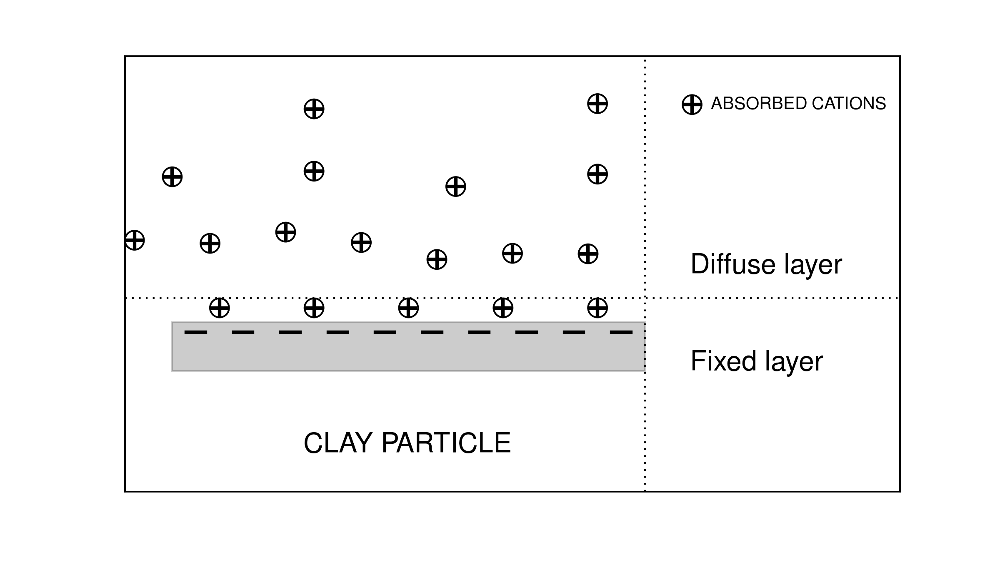

.. _electrical_conductivity_factors:

Factors Impacting Conductivity
==============================

Here are common factors determine conductivity of a rock:

	- Metallic particles
	- Electrolyte in the pore of a rock with large number of ions
	- Temperature
	- Pressure
	- Porosity
	- Rock texture
	- Clay materials

If a rock includes metallic particles, obviously that rock will be conductive
(electric conduction).

Each ion is able to only a certain quantity of charge, it indicates that the
more ions in an solution and faster they move, the greater charge will be
carried which result in greater conductivity of a rock. Hence, the solution
with the greater number of ions will have higher conductivity. Accordingly, a
rock which includes saline water within its pores will have larger
conductivity when the salinity of the water is higher than when it is lower.

An increase in temperature will increase the mobility of ions in the solution
resulting in an increase of the conductivity. Based upon that temperature
increase and salinity decrease with depth, conductivity should increase with
depth. However, the effect of pressure should be considered to understand
conductivity of the earth with depth as we shall explore later.

Most minerals forming rocks are non-conductive. However, the porosity and pore
distribution of a rock specimen will have effect on determining conductivity.
In addition, clay minerals in a rock can be a separate conducting path from
electrolyte conduction, which will increase the conductivity of a rock.

Clay Content
^^^^^^^^^^^^

In the classical petroleum engineering approach to sedimentary rocks, rock
containing clay particle often called “dirty sands”. Since clay particle is
substantially more conductive than the mineral grains, it could be a separate
conducting path. Archie’s law usually working well for sedimentary rocks, and
needs to be corrected. Fundamental cause of this abnormally high conductivity
based upon the double layer of the absorbed cations as shown in
:numref:`DoubleLayer`.

   Conceptual diagram of ions absorbed on clay particle.

The cations are required to balance the charge due to substitution within the
crystal lattice, and to broken bonds. The finite size of the cations prevents
the formation of a single layer. Rather, a “double layer” is created; it is
composed of a “fixed layer” immediately adjacent to the clay surface and a
“diffuse layer” which drops off in charge density exponentially with distance
from the fixed layer. Different from the fixed layer, the diffuse layer is not
fixed but free to move under an applied electric field. This double layer
phenomenon is simply considered as cation selective membrane. And those
cations captured by clay minerals, will be added to the normal ion
concentration and thus increase the density of charge carriers. The net result
is an increased “surface conductivity :cite:`ward1990`.

The impact of a disseminated clay on rock conductivity becomes increasingly
important as the conductance through the pore decreases. Hydrothermal
alteration changes feldspars to kaolinite, montmorillonite, and other clay
minerals, particularly for siliceous rocks. In basics rocks, chlorite and
serpentine may be produced. All of these alteration products exhibit high
conductivity. As the concentration of of the electrolyte increases the
relative contribution of the electrolyte conduction path to the clay
conduction path increases. The total conductivity :math:`\sigma` of a rock can
be expressed as

.. math::
	\sigma = \sigma_n + \sigma_s,

where :math:`\sigma_n` is the normal rock conductivity and :math:`\sigma_s` is
the surficial conductivity  of the clay. Assuming fully saturated rock
(:math:`S_w=1`) and with Archie's law (:math:`\sigma =
\frac{\sigma_e}{F}S_w^{n}`), we obtain :math:`\sigma_n = \frac{\sigma_e}{F}`.
Then, we rewrite above equation as

.. math::
	\sigma = \frac{\sigma_e}{F} + \sigma_s.

This clearly shows that as the concentration of the electrolyte increases the
relative contribution of the electrolyte conduction path (:math:`\sigma_n`) to
the clay conduction path (:math:`\sigma_s`) increases.

:cite:`waxman1968` give the expression for the resistivity of a clay-bearing rock

.. math::
	\rho = \frac{\rho_w F_t}{1+ \rho_w BQ},
	:label: Waxman&Smits

and effectively in conductivity form

.. math::
	\sigma = \frac{\sigma_w+BQ}{F_t},

where B is the factor related to the mobility of exchange cations on the pore
water concentration, Q is the clay cation exchange capacity per unit volume,
and :math:`F_t` is the formation factor at very high concentrations where the
effects of clays can be neglected (the true formation factor). From Eq.
:eq:`Waxman&Smits` an apparent formation factor can be written as

.. math::
	F_a = \frac{\rho_r}{\rho_w} = \frac{F_t}{1+\rho_w BQ}.

Archie's Law
^^^^^^^^^^^^

Archie defined an empirical relationship which considers above factors
defining the conductivity of a sedimentary rock. Archie’s law can be written
as

.. math::
	\sigma = F^{-1} \sigma_w S_w^{n},
	:label: Archies_cond

where :math:`S_w` is the water saturation, :math:`\sigma_w` is the
conductivity of the brine, and :math:`F` is the formation factor. In
resistivity form, this can be written as

.. math::
	\rho = F \rho_w S_w^{-n},
	:label: Archies_resis

where :math:`\rho_w` is the resistivity of the brine. The formation factor is defined as

.. math::
	F = \frac{a}{\phi^m} = \frac{\sigma_w}{\sigma_o} = \frac{\rho_o}{\rho_w},
	:label: Archies_formationfactor

where :math:`\sigma_o` and :math:`\rho_o` are the conductivity and resistivity
of the rock filled with only brine (:math:`S_w=1`), respectively. Here m is
the cementation factor (usually in the range of 1.3<m<2.3), n is the
saturation exponent (usually close to 2), and a is tortuosity factor. The
cementation factor describes how much the pore network decreases the
conductivity (assuming rock itself is not conductive). The more consolidated
rock usually have the greater cementation factor, which is effectively related
to the pressure:

	- For slightly consolidated sandstones m=1.4
	- For consolidated sandstones m=1.7

Tortuosity factor describes the excess length of the equivalent electrolyte
path relative to the rock specimen length, hence the greater tortuosity makes
the greater porosity resulting in higher conductivity.

The resistivity index can be written as

.. math::
	RI = \frac{\rho}{\rho_w} = S_w^{-n},
	:label: Archies_RI

.. note::

	Archie’s law is purely empirical law intending to describe ion flow in
	clean and consolidated sands. Electrical conduction is assumed not to be
	present within the rock grains. Hence it may not work for a rock includes
	considerable amount of clay minerals because a clay or shale particle acts
	as a separate conducting path.

