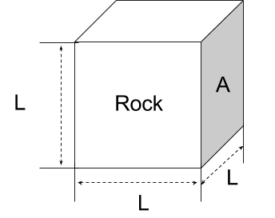
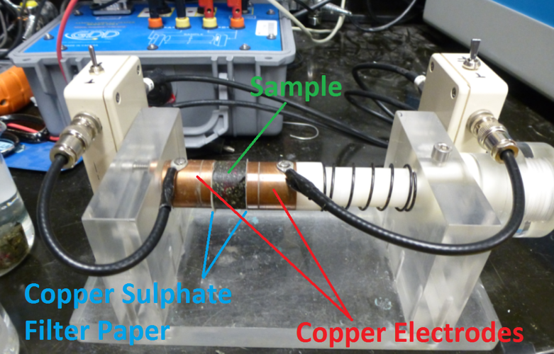
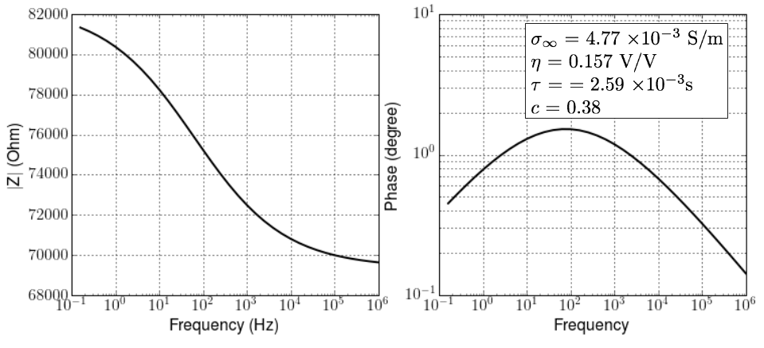

.. _electrical_conductivity_lab_setup_measurements:

Constitutitve relationships and Lab measurments
===============================================

Ohm's Law at DC
---------------

.. figure:: ./figures/DCcircuit_simple.png
   :align: left
   :scale: 80%
   :name: DCcircuit_simple

   A simple DC circuit.

For a simple circuit, Ohm's law:

.. math::
   V=IR

where

- :math:`V`: Voltage (V)
- :math:`I`: Current (A)
- :math:`R`: Resistance (Ohm)

In the lab, the resistor shown in :numref:`DCcircuit_simple` is replaced by cube with size :math:`L`. Accordingly, resistivity and conductivity can be expressed as

   - Resistivity: :math:`\rho = \frac{RA}{L}` (:math:`\Omega\text{-}m`)
   - Conductivity: :math:`\sigma = \frac{1}{\rho} = \frac{L}{RA}` (:math:`S/m`)

Ohm's law analogous to :math:`V=IR` for the circult case become

.. math::
   \mathbf{E}= \rho \mathbf{J},

where

   - :math:`\mathbf{J}` is the electric current (A/:math:`m^2`)
   - :math:`\mathbf{E}` is the electric field (V/m).

But it is usually written as

.. math::
   \mathbf{J}= \sigma \mathbf{E}.

   Figure A rock specimen.

Lab Setup and Measurements
--------------------------

   Complex impedance measurment system at Geological Survey of Canada (GSC).

Electrical conductivity can be frequency-depenent and complex-valued, which is effectively generates polarization effects with the applied electric field. This is often called induced polarization (IP) effects. Lab set-up at GSC shown in :numref:`GSCcompleximpedance` measures complex impedances by injecting sinusoidal currents ranging from 0.016 Hz - 1 MHz (logarithmically-sampled).

   A simple AC circuit.

:numref:`ACcircuit_simple` shows a corresponding circuit diagram for the above measurement set-up. In the :numref:`ACcircuit_simple`, all variables:

- :math:`I(\omega)`: Complex current (A)
- :math:`V(\omega)`: Complex voltage (V)
- :math:`Z(\omega)`: Complex impendance (:math:`\Omega`)

are frequency dependent. :numref:`ComplexImpedance` shows amplitude and phase of the measured complex impedance at a porphyry deposit called `Highland Valley Copper`_.

.. _Highland Valley Copper: https://en.wikipedia.org/wiki/Highland_Valley_Copper_mine

   Amplitude and phase of the measured complex impedance at `Highland Valley Copper`_ deposit.

.. Seogi Dummies

.. Similarly, this can be rewritten as

.. .. math::
..    \mathbf{E}= \rho \mathbf{J},

.. where :math:`\mathbf{J}` is the electric current (A/:math:`m^2`) and :math:`\mathbf{E}` is the electric field (V/m). Using conductivity, $\sigma$, this can be written as

.. .. math::
..    \mathbf{J}= \sigma \mathbf{E},

.. This shows relationship between applied electric field and current. Accordingly, unit of the conductivity will be

..    .. math::
..       \frac{A/m^2}{V/m} = S/m,

.. where S=A/V is the conductance (S). Similarly, unit of the resistivity will be

..    .. math::
..       \frac{V/m}{A/m^2} = \Omega\text{-}m.

.. We interpret units of conductivity and resistitivity as

..    - :math:`\sigma` (S/m): How much current flows with the applied electric field (or voltage).

..    - :math:`\rho` (:math:`\Omega`-m): How much voltage (or electric field) is generated with the appliec current.

.. These can be related how we excite the system (source), and what we measure (receiver).

.. To measure the resistance of a rock specimen (:numref:`cube`), which has a certain length (:math:`l`; :math:`m`) and area (:math:`A`; :math:`m^2`), we need to let the current flow through the rock specimen, and measure potential difference due to the rock.

.. :numref:`DCcircuit` shows as a schematic diagram for a mearsurement system for the resistance of a rock. Since we know, the intensity of an input DC current and measured voltage, then by using Ohm's law (:math:`V=IR`) we can obtain the resistance of a rock (:math:`R=V/I`).

.. .. figure:: ./figures/DCcircuit.png
..    :scale: 50%
..    :align: center
..    :name: DCcircuit

..    Figure A DC circuit.

.. Importantly, measured resistance will be dependent upon the geometry of a rock specimen hence reistance cannot be considered as an intrinsic property of a certain rock. Measured resistance will be depedent upon area and length of the rock. For instance, as we increase the area, the amount of current flow in a rock increases, which makes decrease in resistance. Increased length of the rock will oppose the current flow making increased resistance. This can be formulated as

.. .. math::
..    R = \rho \frac{l}{A},

.. where :math:`\rho` is the resistivity, and this is an intrinsic property of a rock because it is indepdent upon the geometry of a rock specimen. Effectively, the resistivity can be written as

.. .. math::
..    \rho = R\frac{A}{l}

.. We consider the unit of the resisitivty

.. .. math::
..    \Omega \frac{m^2}{m} = \Omega\text{-}m

.. Similarly, the conductivity of a rock, which is the inverse of resistivity can be expressed as

.. .. math::
..    \sigma = \frac{1}{\rho} = S\frac{l}{A},

.. where :math:`S` (S) is the conductance. The unit of conductivity is

.. .. math::
..    \frac{1}{\Omega\text{-}m} = \text{S\m}.
