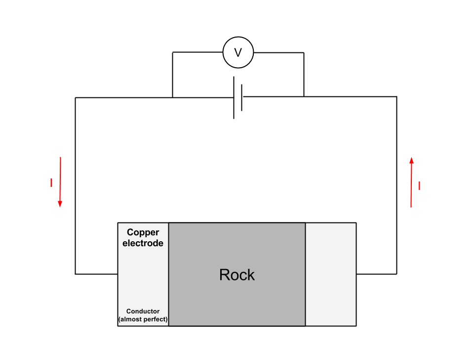
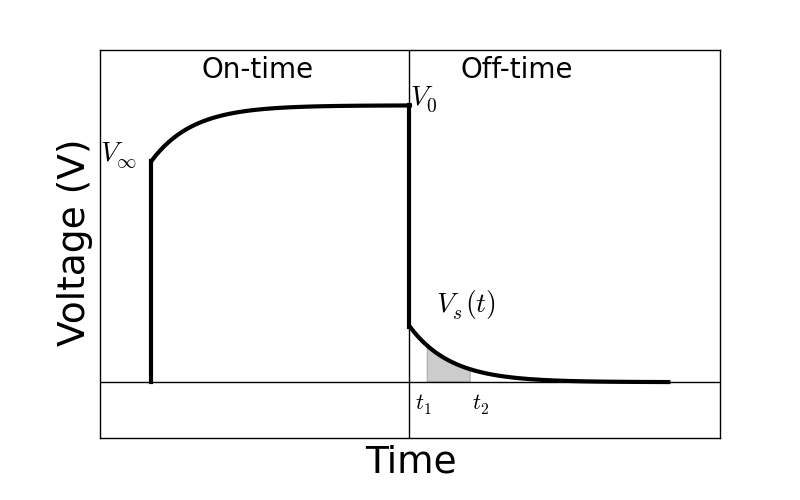

.. _electrical_conductivity_lab_setup_measurements:

Lab set up and measurements
==========================

Electrical conductivity can be frequency-dependent and complex-valued, which is effectively generates polarization effects with the applied electric field. This is often called induced polarization (IP) effects. In order to measure complex conductivity of a rock specimen, we inject sinusoidal that is, AC currents to the rock, and measure voltages. :numref:`GSCcompleximpedance` shows the Lab set-up at GSC. The frequency range of the Lab set-up is from 0.016 Hz - 1 MHz (logarithmically-sampled).

.. figure:: ./figures/GSCcompleximpedance.png
   :scale: 50%
   :align: center
   :name: GSCcompleximpedance

   Complex impedance measurement system at Geological Survey of Canada (GSC).

.. figure:: ./figures/ACcircuit_simple.png
   :scale: 80%
   :align: left
   :name: ACcircuit_simple

   A simple AC circuit.

An equivalent circuit diagram for the Lab measurements is shown in :numref:`ACcircuit_simple`. For a source that is providing a voltage the currents depends upon the conductivity of the rock. The electrical impedance is defined as

.. math::

   Z(\omega) = \frac{V(\omega)}{I(\omega)}

where

- :math:`I(\omega)`: Complex current (A)
- :math:`V(\omega)`: Complex voltage (V)
- :math:`Z(\omega)`: Complex impendance (:math:`\Omega`)

An example of lab measurements is shown :numref:`ComplexImpedance`.

.. figure:: ./figures/ComplexImpedance.png
   :align: left
   :name: ComplexImpedance

   Amplitude and phase of the measured complex impedance at `Highland Valley Copper`_ deposit.

.. _Highland Valley Copper: https://en.wikipedia.org/wiki/Highland_Valley_Copper_mine

We note there are two features of the impedance measurements of interest:

.. note::

   (i) The very low frequency: :math:`f \rightarrow 0` response. This is called the steady-state or "DC" response.

   (ii) The change in the response that occurs with frequency. Any variation is attributed to "chargeability".

Although the "DC" and "chargeability" are really parts of a complete description of the conductivity, it is convenient to treat them individually:

   - DC conductivity / resistivity
   - Chargeability

DC Conductivity / Resistivity
-----------------------------

.. figure:: ./figures/DCcircuit_simple.png
   :align: left
   :scale: 80%
   :name: DCcircuit_simple

   A simple DC circuit.

For a simple circuit, Ohm's law:

.. math::
   V=IR

where

- :math:`V`: Voltage (V)
- :math:`I`: Current (A)
- :math:`R`: Resistance (Ohm)

In the lab, the resistor shown in :numref:`DCcircuit_simple` is replaced by cube with size :math:`L`. Accordingly, resistivity and conductivity can be expressed as

   - Resistivity: :math:`\rho = \frac{RA}{L}` (:math:`\Omega\text{-}m`)
   - Conductivity: :math:`\sigma = \frac{1}{\rho} = \frac{L}{RA}` (:math:`S/m`)

Ohm's law analogous to :math:`V=IR` for the circuit case become

.. math::
   \mathbf{E}= \rho \mathbf{J},

where

   - :math:`\mathbf{J}` is the electric current (A/:math:`m^2`)
   - :math:`\mathbf{E}` is the electric field (V/m).

But it is usually written as

.. math::
   \mathbf{J}= \sigma \mathbf{E}.

.. figure:: ./figures/Cube.png
   :scale: 70%
   :align: center
   :name: Cube

   A rock specimen.

A conceptual diagram of the lab set up for DC conductivity is shown in :numref:`DCsetup`,

   A DC conductivity measurement set-up.

Chargeability
-------------

Chargeability can be measured in both frequency and time domains  as shown in :numref:`ACsetup`.

   - For the frequency domain measurment, we inject sinusoidal currents to the rock

   - For the time domain measurement, we inject half-duty cycle currents including both on- and off-time.

In both measurements, voltages measured are affected by chargeability of the rock hence we can obtain chargeability of the rock.

.. figure:: ./figures/ACsetup.png
   :scale: 70%
   :align: center
   :name: ACsetup

   A chargeability measurement set-up in either frequency or time domain.

Time domain measurements
^^^^^^^^^^^^^^^^^^^^^^^^

Measured voltage can be stacked and we could obtain half-period voltage as shown in :numref:`DCIPcurve`.

- :math:`V_0`: Voltage right after current switch-off (DC)
- :math:`V_{\infty}`: Voltage right after current switch-on
- :math:`V_s(t)`:Voltage at off-time
- :math:`t_1` and :math:`t_2` are arbitrary times determining integration window

When the current switched-on in the on-time, polarization charges start to build up (:math:`V_{\infty}`) then at a late time it asymptotes to steatdy-state (:math:`V_0`). After the current is switched-off built polarization charge is decaying (:math:`V_s`) and asymptotes to zero.

   Figure Measured time domain IP curve.

Data could be

.. math::
   \eta = \frac{V_0-V_\infty}{V_0} \ \text{[V/V]}
   :label: etaintrinsic

.. math::
   \eta^{app} = \int_{t_1}^{t_2} \frac{V_s(t)}{V_0} dt  \ \text{[msec]}
   :label: etaappint_msec

.. math::
   \eta^{app} = \frac{1}{t_2-t_1}\int_{t_1}^{t_2} \frac{V_s(t)}{V_0} dt  \ \text{[mV/V]}
   :label: etaappint_mVV

.. math::
   \eta^{app} = \frac{V_s(t)}{V_0}  \ \text{[mV/V]}
   :label: etaapp_mVV

By definition of the chargeability, :math:`\eta`, it is intrinsic, dimensionless (V/V), and bounded to :math:`[0,1)`. The chargeability can be considered as net voltage difference from infinite to zero frequency normalized by voltage at zero frequency, :math:`V_0`.

However, because we cannot measure exact value of :math:`V_{\infty}` and :math:`V_0`, we often alternatively measure voltage at off-time, :math:`V_s(t)` then integrate in certain range of time to obtain apparent chargeability, :math:`\eta^{app}` as shown in Eq. :eq:`etaappint_msec` and :eq:`etaappint_mVV`.

.. note::
   Depending on the used time window, measured apparent chargeability can under- or over-estimate intrinsic chargeability. For instance, if discharging happens within really short time window and our integration time window is on much later time, then the integrated apparent chargeability could be significantly underestimated.

A simple and often used system on the field is GDD's `SCIP Tester <http://www.gddinstrumentation.com/index.php/scip-tester>`_.

Frequency domain measurements
^^^^^^^^^^^^^^^^^^^^^^^^^^^^^

.. todo::
   PFE (Percent frequency effect)

.. todo::
   Phase difference

