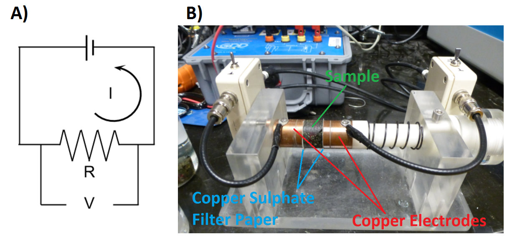
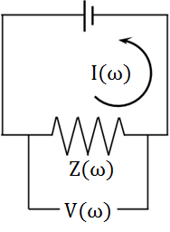
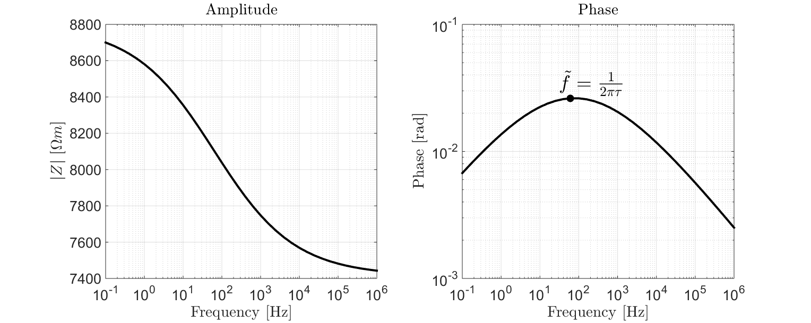
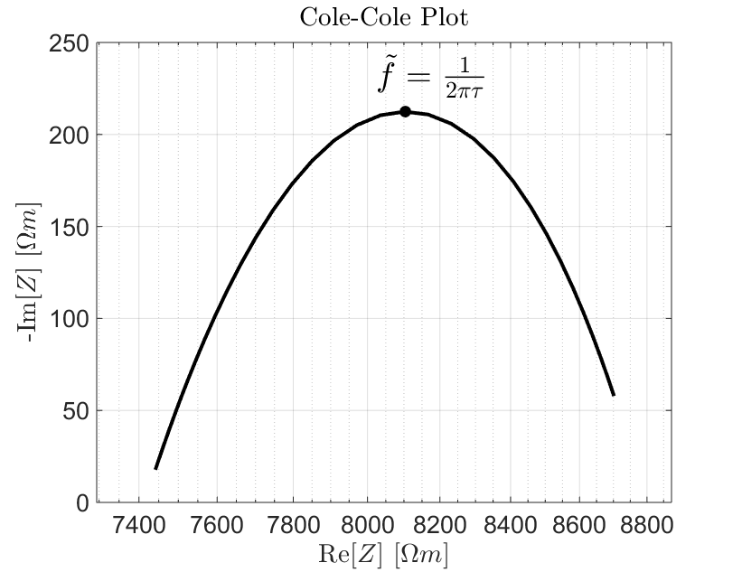
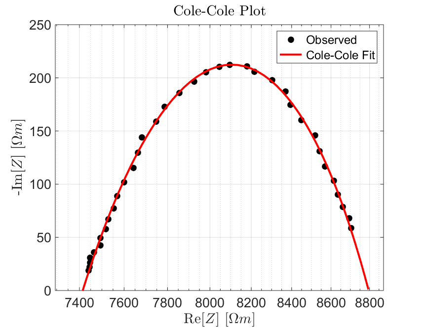
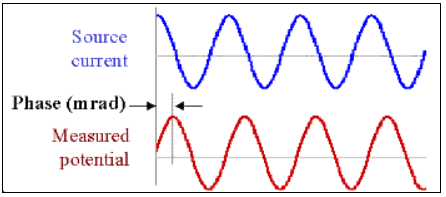
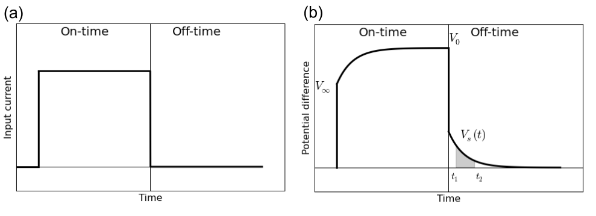

.. _electrical_conductivity_lab_setup_measurements:

Laboratory Measurements
=======================

Electrical conductivity/resistivity measurements are an integral part of classifying physical rock properties. Here, we present the general approach for measuring a rock’s electrical properties, including electrical conductivity/resistivity and chargeability. Instrumentation is also discussed.

Two-Electrode Laboratory Setup
------------------------------

Electrical resistivity measurements are most commonly performed using a two-electrode setup. This is illustrated in :numref:`fig_cond_lab_setup`. For these measurements, a rock core of known dimensions is placed between two copper or graphite electrodes. Current is then forced through the rock, which acts as the resistive element for an electrical circuit. By measuring the voltage drop across the rock (:math:`V`), Ohm's law for electrical circuits can be used to determine the corresponding resistance. In this case:

.. math::
   V = IR
   :label: phys_prop_ohm_circuit

where :math:`I` is the current being forced through the rock and :math:`R` is the resistance due to the rock sample. Given that we know the dimensions of the rock sample, Pouillet's law can be used to obtain the rock's electrical resistivity. Pouillet's law is given by:

.. math::
   \rho = \frac{RA}{l}
   :label: phys_prop_pouillet

where :math:`l` is the length of the sample and :math:`A` is its cross-sectional area. The electrical conductivity is obtained simply by taking the reciprocal of the resistivity, i.e.:

.. math::
   \sigma = \frac{1}{\rho}
   :label: phys_prop_cond_recip

Electrical resistivity measurements can be performed in both the frequency domain and the time domain. For frequency domain measurements, a sinusoidal current is driven through the rock sample. We will show that changes must be made to the aforementioned equations in the case of frequency domain measurements. In the time domain, a boxcar waveform is used.

   Basic setup for electrical resistivity measurements. (A) Theoretical circuit where rock acts as a a resistive element. (B) Rock sample between two electrodes. (C) Circuit schematic for frequency domain and time domain measurements.

   Electrical circuit for DC resistivity measurements.

DC Conductivity/Resistivity
---------------------------

The DC (or zero-frequency) resistivity is obtained by forcing direct current (:math:`I`) through the rock and measuring the voltage drop (:math:`V`). The resistance (:math:`R`) due to the rock is obtained by using Ohm's law Eq. :eq:`phys_prop_ohm_circuit`. The electrical resistivity is then obtained by using Eq. :eq:`phys_prop_pouillet`. The DC resistivity is a single, real-valued quantity and has units Ohm meters (:math:`\Omega m`).

Frequency-Domain Measurements
-----------------------------

Electrical resistivity can be frequency-dependent and complex-valued, which
effectively generates polarization effects with the applied electric field.
This is often called induced polarization (IP) effects. In order to measure
complex conductivity of a rock specimen, we inject sinusoidal currents (that is, AC
currents) into to the rock at logarithmically spaced frequencies and measure the corresponding voltages. The typical frequency range for these measurement is from 0.01 Hz - 1 MHz.

   Electrical circuit for frequency-domain measurements.

In this case, the impedance attributed to the rock sample and the voltage measured across it are frequency-dependent and complex. For frequency domain measurements, Eq. :eq:`phys_prop_ohm_circuit` (Ohm's law) is given by:

.. math::
   Z(\omega) = \frac{V(\omega)}{I(\omega)}

where :math:`I(\omega)` is the current which flows through the rock sample, :math:`V(\omega)` is the voltage measured across the rock, and :math:`Z(\omega)` is the corresponding electrical impedance (complex resistance). By altering Eq. :eq:`phys_prop_pouillet` accordingly, the resistivity of the rock is given by:

.. math::
   \rho (\omega) = \frac{Z(\omega) A}{l}

Representing Frequency-Domain Measurements
^^^^^^^^^^^^^^^^^^^^^^^^^^^^^^^^^^^^^^^^^^

There are several ways in which frequency-domain measurements can be represented. These are illustrated below. Generally we plot the complex impedance. However, impedance values can easily be converted to resistivity or conductivity values and plotted.

**Amplitude and Phase**

Frequency domain measurements are frequently plotted in terms of amplitude and phase. As we can see from :numref:`fig_props_amp_phase`, the amplitude is a monotonic decreasing function with respect to frequency. According to the phase plot, the frequency corresponding to the largest phase occurs at roughly :math:`\tilde f = 1/2\pi\tau`.

   Amplitude and phase plot for a sample with :math:`\rho_0 = 8.8 \times 10^3 \; \Omega \!` m, :math:`\eta=0.157` V/V, :math:`\tau=2.59 \times 10^{-3}` s and :math:`C=0.38`.

   Cole-Cole plot for a sample with :math:`\rho_0 = 8.8 \times 10^3 \; \Omega \!` m, :math:`\eta=0.157` V/V, :math:`\tau=2.59 \times 10^{-3}` s and :math:`C=0.38`.

**Cole-Cole Plot**

The Cole-Cole plot is also a popular choice for visualizing frequency-domain measurements. Here, the real component of the complex impedance is plotted on the X-axis and the negative imaginary component is plotted on the Y-axis. The largest imaginary component occurs at :math:`\tilde f = 1/2\pi\tau`. This is the frequency at which induced polarization is most significant for the sample. The characteristic behaviour shown in :numref:`fig_props_Cole_Cole` is frequently referred as an impedance arc or "Zarc".

Measuring DC Resistivity and Chargeability
^^^^^^^^^^^^^^^^^^^^^^^^^^^^^^^^^^^^^^^^^^

**Electrical Impedance Spectroscopy**

Recovering the DC resistivity and chargeability from frequency-domain measurements requires an appropriate model for describing the sample's electric properties. From the previous page, we stated that electrical rock properties can generally be characterized using the Cole-Cole model. For an individual sample:

   Cole-Cole fit showing a sample with :math:`\rho_0 = 8.8 \times 10^3 \; \Omega \!` m, :math:`\eta=0.157` V/V, :math:`\tau=2.59 \times 10^{-3}` s and :math:`C=0.38`.

1) The complex impedance is measured at logarithmically spaced frequencies between 0.01 Hz and 1 MHz.
2) The dimensions of the sample are then used to obtain the corresponding resistivity values according to :eq:`phys_prop_pouillet`.
3) Resistivity values are fit using the Cole-Cole model, which is subsequently used to obtain values for the DC resistivity (:math:`\rho_0`) and chargeability (:math:`\eta`).

Recall that the Cole-Cole model for electrical resistivity is given by:

.. math::
  \rho (\omega) = \rho_0 \Bigg [ 1 - \eta \Bigg ( 1 - \frac{1}{1 + (i\omega \tau)^C} \Bigg ) \Bigg ]

**Percent Frequency Effect**

A simpler form of frequency domain measurements is done with two frequencies. If the rock is non-chargeable, then frequency-dependence of the sample's resistivity is negligible; resulting in near-identical voltage measurements at each frequency. For increasingly chargeable samples, the difference in absolute resistivity becomes larger. Percent frequency effect is used to describe this effect. The percent frequency effect is defined as:

.. math::
   PFE = \Bigg ( \frac{V(f_1) - V(f_2)}{V(f_2)} \Bigg ) \times 100 \% = \Bigg ( \frac{\rho (f_1) - \rho (f_2)}{\rho (f_2)} \Bigg ) \times 100 \%

where :math:`V(f_1)` is the absolute voltage measured at a lower frequency and :math:`V(f_2)` is the absolute voltage measured at a higher frequency. The percent frequency effect can also be expressed in terms of the absolute resistivity, where :math:`\rho (f_1)` is the absolute resistivity measured at a lower frequency and :math:`\rho (f_2)` is the absolute resistivity measured at a higher frequency.

**Phase Difference**

   Measured voltage showing a change in phase due to induced polarization effects.

Chargeability is sometimes inferred by measuring the complex impedance at a particular frequency and determining its phase relative to that of the current:

.. math::
   \phi = \textrm{tan}^{-1} \Bigg ( \frac{V (\omega)}{I (\omega)} \Bigg )

By examining :numref:`fig_props_amp_phase` and :numref:`fig_props_Cole_Cole`, we can see that the effects of chargeability are largest when the phase angle is at its maximum. Therefore, the larger the phase, the more dominant IP effects are for the sample. These data are generally given in units of milliradians [mrad].

Time-Domain Measurements
------------------------

Electrical resistivity and chargeability can also be measured in the time domain. The experimental setup for time domain measurements is more or less the same as is shown in :numref:`fig_cond_lab_setup`. In this case, a boxcar waveform is used to excite the sample and voltages are measured during both the on-time and the off-time (:numref:`cond_volt_tdem`).

   Time-domain measurements. (a) Boxcar current waveform. (b) Measured voltage across the rock.

At the moment in which current is initially forced through the rock sample, there is an instantaneous increase in the measured voltage (:math:`V_\infty`). As ionic charges build up, there is a relaxation process in which the measured voltage approaches a steady-state (or DC) voltage (:math:`V_0`). After sufficient time, the current source is turned off and there is an instantaneous drop in measured voltage equal to :math:`V_\infty`. It takes time for the rock to "discharge" due to induced polarization effects. As a result, there is a measurable voltage across the rock during the off-time which we denote as :math:`V_s(t)`. In practice, the boxcar excitation is applied many times and the data are stacked.

Measuring DC Resistivity
^^^^^^^^^^^^^^^^^^^^^^^^

For time-domain measurements, DC resistivity is easy to measure. The DC voltage is measured by applying direct current for a sufficient amount of time. In :numref:`cond_volt_tdem`, this voltage is given by :math:`V_0`. Once obtained, Eq. :eq:`phys_prop_ohm_circuit` (Ohm's law) can be used to obtain the DC resistance (:math:`R_{DC}`):

.. math::
   R_{DC} = \frac{V_0}{I_0}

and Eq. :eq:`phys_prop_pouillet` can be used to obtain the DC resistivity:

.. math::
   \rho_0 = \frac{R_{DC} A}{l}

Cole-Cole Chargeability
^^^^^^^^^^^^^^^^^^^^^^^

According to the Cole-Cole model, the chargeability can be defined as the fractional difference between the DC resistivity and the resistivity as :math:`\omega \rightarrow \infty` (or :math:`\rho_\infty`):

.. math::
   \eta = \frac{\rho_0 - \rho_\infty}{\rho_0}

However, it can also be shown that the chargeability is the fractional difference between the measured DC voltage (:math:`V_0`) across the rock sample and the instantaneous increase in voltage (:math:`V_\infty`) observed when the current is turned on. Thus:

.. math::
   \eta = \frac{V_0 - V_\infty}{V_0}

Although the formal definition comes directly from our model for electrical resistivity, the latter definition is more relevant in a laboratory setting. In an ideal scenario, it would be possible to measure :math:`V_0` and :math:`V_\infty` directly and use to previous equation to calculate the chargeability. Unfortunately, there are high-frequency phenomena which significantly impact the measured voltage at the moment the current is applied or removed. This obstacle is overcome by measuring intrinsic values for rock chargeability.

Intrinsic Chargeability Measurements
^^^^^^^^^^^^^^^^^^^^^^^^^^^^^^^^^^^^

Intrinsic chargeability measurements are performed by measuring the off-time voltage (:math:`V_s(t)` in :numref:`cond_volt_tdem`) and integrating over a specified range of time channels [:math:`t_1,t_2`]. This is meant to characterize the induced polarization which occurs over time channels relevant to geophysical surveying methods. The intrinsic chargeability is frequently referred to as the *apparent chargeability* (:math:`\eta_{app}`). There are two common ways to define the apparent chargeability. Either the off-time voltage is integrated between :math:`t_1` and :math:`t_2`:

.. math::
   \eta_{app} = \int_{t_1}^{t_2} \frac{V_s(t)}{V_0} dt

and the apparent chargeability is given in units of milliseconds [ms]. Or the off-time voltage is integrated between :math:`t_1` and :math:`t_2` and normalized by the time interval:

.. math::
   \eta_{app} = \frac{1}{t_2 - t_1} \int_{t_1}^{t_2} \frac{V_s(t)}{V_0} dt

In this case, the apparent chargeability is given in units of milli-Volts per Volt [mV/V], or as a unitless quantity. Intrinsic chargeability values depend greatly on the definition as well as integration time. There are several common conventions. A well-established choice is the Newmont Standard chargeability which integrated between 0.15 s and 1.1 s.

