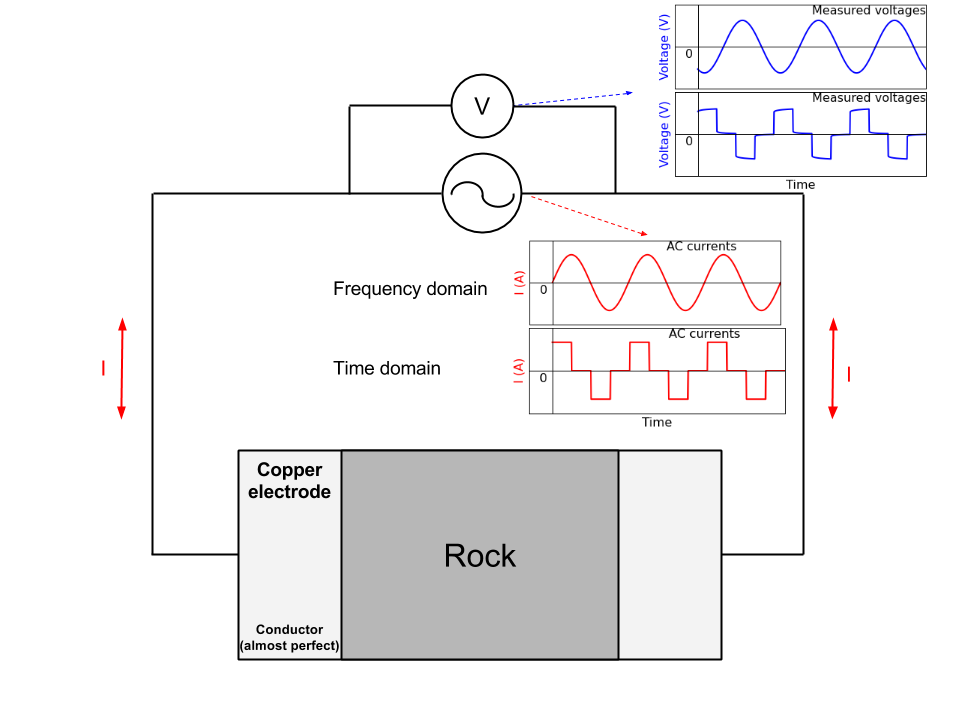
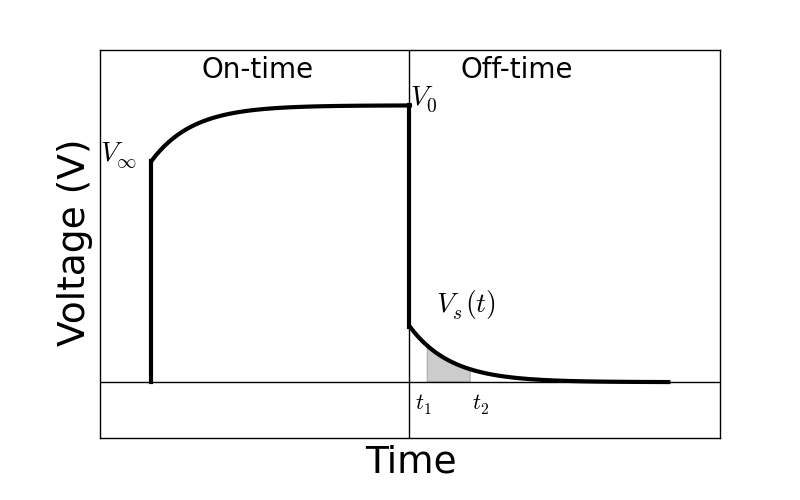

.. _electrical_conductivity_lab_setup_measurements:

Laboratory Measurements
=======================

Electrical conductivity/resistivity measurements are an integral part of classifying physical rock properties. Here, we present the general approach for measuring a rock’s electrical properties, including electrical conductivity/resistivity and chargeability. Instrumentation is also discussed

Two-Electrode Laboratory Setup
------------------------------

Electrical resistivity measurements are most commonly performed using a two-electrode setup. This is illustrated in :numref:`fig_cond_lab_setup`. For these measurements, a rock core of known dimension is placed between two copper or graphite electrodes. Current is then forced through the rock, which acts as the resistive element for an electrical circuit. By measuring the voltage drop across the rock, Ohm's law can be used to determine the corresponding resistance. Given that we know the dimensions of the rock sample, Pouillet's law can be used to obtain the rock's electrical resistivity. The electrical conductivity is obtained by taking the reciprocal of the resistivity.

.. figure:: ./images/cond_lab_setup.png
   :figwidth: 75%
   :align: center
   :name: fig_cond_lab_setup

   Basic setup for electrical resistivity measurements. (A) Theoretical circuit where rock acts as a a resistive element. (B) Rock sample between two electrodes.

DC Conductivity/Resistivity
---------------------------

.. figure:: ./images/DCcircuit_simple.png
   :figwidth: 25%
   :align: right
   :name: fig_DC_measurements

   Electrical circuit for DC resistivity measurements.

The DC (or zero-frequency) resistivity is obtained by forcing direct current (:math:`I`) through the rock and measuring the voltage drop (:math:`V`). Using Ohm's law, the resistance (:math:`R`) due to the rock is given by:

.. math::
   R = \frac{V}{I}

According to Pouillet's law, the electrical resistivity of the sample is the product of the resistance and the cross-sectional area (:math:`A`), divided by the sample's length (:math:`l`):

.. math::
   \rho = \frac{RA}{l}

The DC resistivity is a single, real-valued quantity.

Frequency-Domain Measurements
-----------------------------

Electrical conductivity can be frequency-dependent and complex-valued, which
effectively generates polarization effects with the applied electric field.
This is often called induced polarization (IP) effects. In order to measure
complex conductivity of a rock specimen, we inject sinusoidal currents (that is, AC
currents) into to the rock at logarithmically spaced frequencies and measure the corresponding voltages. The typical frequency range for these measurement is from 0.016 Hz - 1 MHz.

.. figure:: ./images/Zcircuit_simple.png
   :figwidth: 25%
   :align: right
   :name: fig_Z_measurements

   Electrical circuit for frequency-domain measurements.

In this case, the impedance attributed to the rock core and the voltage measured across it are frequency-dependent and complex. Ohm's law is therefore expressed as:

.. math::
   Z(\omega) = \frac{V(\omega)}{I(\omega)}

where :math:`I(\omega)` is the current which flows through the rock sample, :math:`V(\omega)` is the voltage measured across the rock, and :math:`Z(\omega)` is the corresponding electric impedance. Using Pouillet's equation, the resistivity of the rock is given by:

.. math::
   \rho (\omega) = \frac{Z(\omega) A}{l}

Representing Frequency-Domain Measurements
^^^^^^^^^^^^^^^^^^^^^^^^^^^^^^^^^^^^^^^^^^

There are several ways in which frequency-domain measurements can be represented. These are illustrated below. Generally we plot the complex impedance. However, impedance values can easily be converted to resistivity or conductivity values and plotted.

**Amplitude and Phase**

Frequency domain measurements are frequently plotted in terms of amplitude and phase. As we can see from :numref:`fig_props_amp_phase`, the amplitude is a monotonic decreasing function with respect to frequency. According to the phase plot, the frequency corresponding to the large phase occurs at roughly :math:`\tilde f = 1/2\pi\tau`.

.. figure:: ./images/amp_phase_plot.png
   :figwidth: 100%
   :align: center
   :name: fig_props_amp_phase

   Amplitude and phase plot for a sample with :math:`\rho_0 = 8.8 \times 10^3 \; \Omega \!` m, :math:`\eta=0.157` V/V, :math:`\tau=2.59 \times 10^{-3}` s and :math:`C=0.38`.

.. figure:: ./images/Cole_Cole_plot.png
   :figwidth: 50%
   :align: right
   :name: fig_props_Cole_Cole

   Cole-Cole plot for a sample with :math:`\rho_0 = 8.8 \times 10^3 \; \Omega \!` m, :math:`\eta=0.157` V/V, :math:`\tau=2.59 \times 10^{-3}` s and :math:`C=0.38`.

**Cole-Cole Plot**

The Cole-Cole plot is also a popular choice for visualizing frequency-domain measurements. Here, the real component of the complex impedance is plotted on the X-axis and the negative imaginary component is plotted on the Y-axis. The largest imaginary component occurs at :math:`\tilde f = 1/2\pi\tau`. This is the frequency at which induced polarization is most significant for the sample. The characteristic behaviour shown in :numref:`fig_props_Cole_Cole` is frequently referred as an impedance arc or "Zarc".

Measuring DC Resistivity and Chargeability
^^^^^^^^^^^^^^^^^^^^^^^^^^^^^^^^^^^^^^^^^^

Recovering the DC resistivity and chargeability from frequency-domain measurements requires an appropriate model for describing the sample's electric properties. From the previous page, we stated that electrical rock properties can generally be characterized using the Cole-Cole model. For an individual sample:

.. figure:: ./images/Cole_Cole_fit.png
   :figwidth: 50%
   :align: right
   :name: fig_props_Cole_Cole_fit

   Cole-Cole fit showing a sample with :math:`\rho_0 = 8.8 \times 10^3 \; \Omega \!` m, :math:`\eta=0.157` V/V, :math:`\tau=2.59 \times 10^{-3}` s and :math:`C=0.38`.

1) The complex impedance is measured at logarithmically spaced frequencies between 0.016 Hz and 1 MHz.
2) The dimensions of the sample are then used to obtain the corresponding resistivity values according to Pouillet's equation.
3) Resistivity values are fit using the Cole-Cole model, which is subsequently used to obtain values for the DC resistivity (:math:`\rho_0`) and chargeability (:math:`\eta`).

Recall that the Cole-Cole model for electrical resistivity is given by:

.. math::
  \rho (\omega) = \rho_0 \Bigg [ 1 - \eta \Bigg ( 1 - \frac{1}{1 + (i\omega \tau)^C} \Bigg ) \Bigg ]

Time-Domain Measurements
------------------------

sdfasfa

|
|
|
|
|
|
|
|
|
|
|
|
|

Chargeability
-------------

Chargeability can be measured in both the frequency and time domain as shown
in :numref:`ACsetup`.

- For the frequency domain measurement, we inject sinusoidal currents in to the rock.

- For the time domain measurement, we inject half-duty cycle currents
  including both onand off-time.

In both measurements, voltages measured are affected by chargeability of the
rock hence we can obtain chargeability of the rock.

   A chargeability measurement set-up in either frequency or time domain.

Time domain measurements
^^^^^^^^^^^^^^^^^^^^^^^^

Measured voltage can be stacked and we could obtain half-period voltage as
shown in :numref:`DCIPcurve`.

- :math:`V_0`: Voltage right after current switch-off (DC)
- :math:`V_{\infty}`: Voltage right after current switch-on
- :math:`V_s(t)`:Voltage at off-time
- :math:`t_1` and :math:`t_2` are arbitrary times determining integration window

When the current is switched on in the on-time, polarization charges start to
build up (:math:`V_{\infty}`). Then at late time, it asymptotes to steady-
state (:math:`V_0`). After the current is switched off, built polarization
charge is decaying (:math:`V_s`) and asymptotes to zero.

   Figure Measured time domain IP curve.

Data could be:

.. math::
   \eta = \frac{V_0-V_\infty}{V_0} \ \text{[V/V]}
   :label: etaintrinsic

.. math::
   \eta^{app} = \int_{t_1}^{t_2} \frac{V_s(t)}{V_0} dt  \ \text{[msec]}
   :label: etaappint_msec

.. math::
   \eta^{app} = \frac{1}{t_2-t_1}\int_{t_1}^{t_2} \frac{V_s(t)}{V_0} dt  \ \text{[mV/V]}
   :label: etaappint_mVV

.. math::
   \eta^{app} = \frac{V_s(t)}{V_0}  \ \text{[mV/V]}
   :label: etaapp_mVV

By definition of the chargeability, :math:`\eta`, it is intrinsic,
dimensionless (V/V), and bounded to :math:`[0,1)`. The chargeability can be
considered as net voltage difference from infinite to zero frequency
normalized by voltage at zero frequency, :math:`V_0`.

However, because we cannot measure exact value of :math:`V_{\infty}` and
:math:`V_0`, we often alternatively measure voltage at off-time,
:math:`V_s(t)` then integrate in certain range of time to obtain apparent
chargeability, :math:`\eta^{app}` as shown in Eq. :eq:`etaappint_msec` and
:eq:`etaappint_mVV`.

.. note::

   Depending on the used time window, measured apparent chargeability can
   under- or over-estimate intrinsic chargeability. For instance, if
   discharging happens within really short time window and our integration
   time window is on much later time, then the integrated apparent
   chargeability could be significantly underestimated.

A simple and often used system in the field is GDD's `SCIP Tester
<http://www.gddinstrumentation.com/index.php/scip-tester>`_.

Frequency domain measurements
^^^^^^^^^^^^^^^^^^^^^^^^^^^^^

.. todo::
   PFE (Percent frequency effect)

.. todo::
   Phase difference

