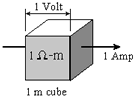
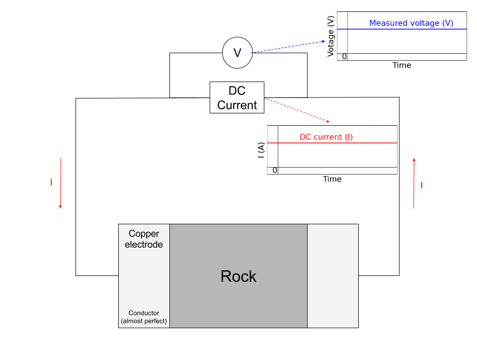

.. _electrical_conductivity_lab_setup_measurements:

Constitutitve relationships
===========================

A fundamental relationship between the applied electric field and current governed by Ohm’s law:

   .. math::
      \vec{J} = \sigma \vec{E},

where :math:`\vec{J}` is the electric current (A/:math:`m^2`) and :math:`\vec{E}` is the electric field (V/m). Accordingly, unit of the conductivity will be

   .. math::
      \frac{A/m^2}{V/m} = S/m,

where S=A/V is the conductance (S). Similarly, unit of the resistivity will be

   .. math::
      \frac{V/m}{A/m^2} = \Omega\text{-}m.

We interpret units of conductivity and resistitivity as

   - :math:`\sigma` (S/m): How much current flows with the applied electric field (or voltage).

   - :math:`\rho` (:math:`\Omega`-m): How much voltage (or electric field) is generated with the appliec current.

These can be related how we excite the system (source), and what we measure (receiver).

Lab Setup and Measurements
==========================

To measure the resistance of a rock specimen (:numref:`cube`), which has a certain length (:math:`l`; :math:`m`) and area (:math:`A`; :math:`m^2`), we need to let the current flow through the rock specimen, and measure potential difference due to the rock.

   Figure A rock specimen.

:numref:`DCcircuit` shows as a schematic diagram for a mearsurement system for the resistance of a rock. Since we know, the intensity of an input DC current and measured voltage, then by using Ohm's law (:math:`V=IR`) we can obtain the resistance of a rock (:math:`R=V/I`).

   Figure A DC circuit.

Importantly, measured resistance will be dependent upon the geometry of a rock specimen hence reistance cannot be considered as an intrinsic property of a certain rock. Measured resistance will be depedent upon area and length of the rock. For instance, as we increase the area, the amount of current flow in a rock increases, which makes decrease in resistance. Increased length of the rock will oppose the current flow making increased resistance. This can be formulated as

.. math::
	R = \rho \frac{l}{A},

where :math:`\rho` is the resistivity, and this is an intrinsic property of a rock because it is indepdent upon the geometry of a rock specimen. Effectively, the resistivity can be written as

.. math::
	\rho = R\frac{A}{l}

We consider the unit of the resisitivty

.. math::
	\Omega \frac{m^2}{m} = \Omega\text{-}m

Similarly, the conductivity of a rock, which is the inverse of resistivity can be expressed as

.. math::
	\sigma = \frac{1}{\rho} = S\frac{l}{A},

where :math:`S` (S) is the conductance. The unit of conductivity is

.. math::
	\frac{1}{\Omega\text{-}m} = \text{S\m}.

