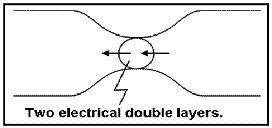
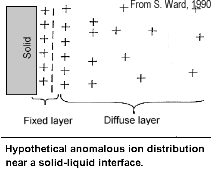
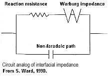
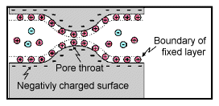
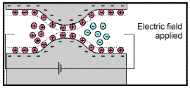
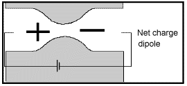

.. _electrical_conductivity_mechanisms:

Mechanisms for Conductivity and Chargeability
=============================================

Electric and Ionic Conduction
-----------------------------

Electrical conduction is the movement of electrical charge from on location
to another, and two important charge carriers are electrons and ions, which
will define the conductivity of a rock. Considering this, we express
conductivity as

.. math::
	\sigma = n e \mu_e,

where :math:`n` is the number of charge carriers, :math:`e` is charge carried
by each charge carrier, and :math:`\mu_e` is the mobility of carriers. Hence,
the conductivity of a rock can be determined by its capability to move charges
by charge carriers: electrons and ions. This classifies two main different
types: a) Electric and b) Ionic conductions.

Electric conductivity
^^^^^^^^^^^^^^^^^^^^^

Both conductions are related to random motion of particles affected by an
applied electric field. However, how charge moves in conduction processes are
quite different. The charge carrier for the electric conduction is electron,
which will define conductivity of most metals such as iron and copper. The
random motion of valence electrons (a measure of its combining power with
other atoms) among the atom is ordered by the application of an external
electric field. The electrons then travel with a drift velocity through solid.

Ionic conductivity
^^^^^^^^^^^^^^^^^^

Conduction in surface rocks is mostly electrolytic, taking place in the
connected pore spaces, along grain boundaries and in fractures, but negligibly
through the mineral grains or silicate framework :cite:`ward1990`. For this
case, the charge carrier is mostly ions dissolved in an electrolyte, so we
often call this as ionic conductivity. Ionic conductivity of a rock is ranging
from :math:`10^{3}`-:math:`10^{-5}` S/m. Porous media such as rocks at the
earth’s surface that we are usually dealing with can be considered to solid
semi-conductor.

Ionic conductivity is resulting from the ordered movement of ions in an
electrolyte under the application of an external electric field. Without an
external electric field, the ions move randomly as a result of thermal
agitation and collisions with other ions and atoms. Because both cations (+)
and anions (-) are present in an electrolyte, the conductivity can be
expressed as

.. math::
	\sigma = e(n^+\mu_m^+ + n^-\mu_m^-),

where :math:`n` is the number of charge carriers, :math:`e` is the charge
carried, and :math:`\mu_m` is the mobility of the carriers. Here superscripts
+ and - stand for cation and anion.

Electrode and Membrane Polarization
-----------------------------------

The chargeability of earth materials is essentially an electrochemical effect
caused by many factors, not all of which are completely understood. If ground
is chargeable, it responds as if resistivity was a complex quantity - it
behaves somewhat like a leaky capacitor. Therefore the chargeability can be
measured in a number of ways using time domain or frequency domain techniques.
Aspects affecting the chargeability of a sample include:

    - the grain size of particles in the sample;
    - the type and mobility of ions within the pore fluids;
    - the details of microscopic interactions between solid surfaces and fluids;
    - the amount of surface area within a specific volume.

The surface area-to-volume ratio is an important factor. Clays tend to be
chargeable while sandstones are not, and the images here illustrate one reason
why this is true. In addition, the surface interactions between clay minerals
and fluids enhance the ability of these materials to hold charges.

There are two primary causes of chargeability. In both cases the re-
distribution of charges takes some time to occur when an external DC electric
field is applied. Equivalently, it takes the same time to revert to a balanced
charge distribution once the electric field is removed. "Charging" is hard to
measure in practice. "Discharging" is measured using time domain IP survey
techniques. The effect of finite charging time on sinusoidal signals at
different frequencies also can be measured using frequency domain or phase IP
surveys. The two types of polarization are called "membrane polarization" and
"electrode polarization."

.. note::

    - Induced polarization is greater when there are larger regions of
      adsorbed anomalous charge (adjacent to an interface); i.e. when there is
      a large surface area-to-volume ratio.

    - Non-ionic fluids (such as contaminants) can markedly change the
      behavior of surface-electrolyte interactions.

    - Changes in ion concentration (such as increased salinity) will also
      affect both types of polarization.

    - Both effects (membrane and electrode polarization) are related to grain
      size as much as material type. Therefore, discrimination of mineral type
      on the basis of chargeability alone is not recommended.

Electrode Polarization
^^^^^^^^^^^^^^^^^^^^^^

Electrode polarization occurs when pore space is blocked by metallic
particles. Again, charges accumulate when an electric field is applied.

.. figure:: ./images/elec_pol_1.gif
	:align: center
	:scale: 100 %

The result is two electrical double layers which add to voltages measured at
the surface.

Some remarks are appropriate here in order to provide some sense of the
complexity of the chargeability phenomenon.

At an interface between ionic and metallic conduction (for example, an ore
grain in pore water), there is an impedance involved in getting current to
flow across the barrier. These interfaces look like the top figure and have
the simplified circuit analogue shown in the bottom figure.

Current can flow via charge transfer (or ion diffusion), which involves
electrochemical processes, or via a capacitive effect (no charge transfer),
involving diffusion currents.

Ion diffusion is not easy to model with circuit elements. The process is
called the Warburg impedance. Its magnitude varies as approximately
1/frequency.

Note that, while it is useful to understand simplified models of the relevant
electrical behavior of surface-electrolyte interactions, all rocks are, in
fact, "dirty" in the sense that they are not simply pure "electrodes" (semi-
conducting mineral grains) and electrolytes (pore solutions).  There are other
materials and particles affecting ionic behavior within and outside the
diffuse layer, and some of the sample's constituents will affect the behavior
of the fixed layer near and on the liquid-solid interfaces.

Membrane Polarization
^^^^^^^^^^^^^^^^^^^^^

Membrane polarization occurs when pore space narrows to within several
boundary layer thicknesses (which is the thickness of ions adsorbed to a
surface).

Charges cannot flow easily, so they accumulate when an electric field is
applied.

The result is a net charge dipole which adds to any other voltages measured at
the surface.

A second form of membrane polarization is similar to the first:

 .. figure:: ./images/memb_pol_2nd_type.gif
	:align: right
	:scale: 100	%

This occurs where clay particles partially block ionic solution paths, as in
the adjacent figure. Upon application of an electric potential, positive
charge carriers pass easily, while negative carriers accumulate. There is an
"ion-selective membrane."

A surplus of both cations and anions occurs at one end of the membrane, while
a deficiency occurs at the other end. The reduction of mobility is most
obvious at frequencies slower than the diffusion time of ions between adjacent
membrane zones; i.e. slower than around 0.1 Hz. Conductivity increases at
higher frequencies.

