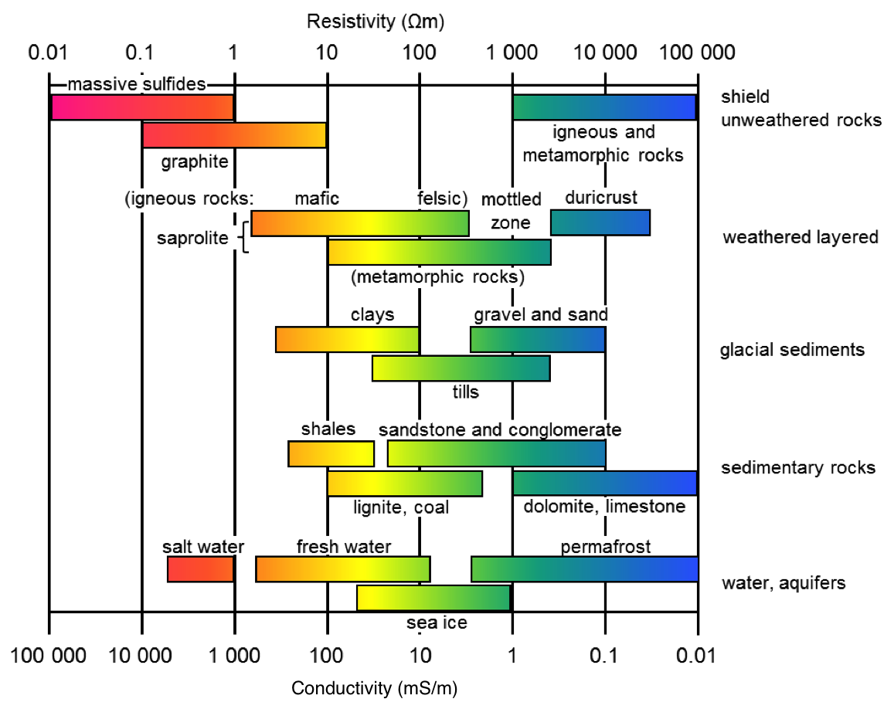

.. _electrical_conductivity_values:

Typical Values for Rocks
========================

DC Conductivity/Resistivity
---------------------------

The conductivities/resistivities of rocks span many orders of magnitude. For common rock types, this is illustrated below.

	Electrical conductivity and resistivity of common rocks.

The conductivity/resistivity of a rock depends significantly on its mineralogy and pore-water properties. To demonstrate this, the conductivities and resistivities of water and certain rock forming minerals are provided.

	Various conductivity values for different materials.

Chargeability
-------------

The following tables (from Telford et al, 1976) provides a very general guide to possible chargeabilities of materials. One reason that in-situ chargeabilities tend to appear lower than laboratory values is that large volumes of mixed materials are involved in field measurements.

These examples show that a wide range of variability can be expected, implying that it is difficult to use values of intrinsic chargeability (in models obtained by inversion of IP data) to determine exactly what type of rock or material is in the ground. However, this is an ongoing topic of research.

**Table 1:** The values below involved more realistic charging and integration times of 3 seconds and 0.02-1.0 seconds respectively.

+-----------------------+--------------------------+
|  **Material type**    | **Chargeability (msec)** |
+=======================+==========================+
| ground water          | 0                        |
+-----------------------+--------------------------+
| alluvium              | 1-4                      |
+-----------------------+--------------------------+
| gravels               | 3-9                      |
+-----------------------+--------------------------+
| precambrian volcanics | 8-20                     |
+-----------------------+--------------------------+
| precambrian gneisses  | 6-30                     |
+-----------------------+--------------------------+
| schists           	| 5-20                     |
+-----------------------+--------------------------+
| sandstones            | 3-12                     |
+-----------------------+--------------------------+
| argilites             | 3-10                     |
+-----------------------+--------------------------+
| quartzites            | 5-12                     |
+-----------------------+--------------------------+

**Table 2:** Chargeability of minerals at 1% concentration in the samples (charging and integration times as per Table 2 above)

+-----------------------+--------------------------+
|  **Material type**    | **Chargeability (msec)** |
+=======================+==========================+
| pyrite                | 13.4                     |
+-----------------------+--------------------------+
| chalcocite            | 13.2                     |
+-----------------------+--------------------------+
| copper                | 12.3                     |
+-----------------------+--------------------------+
| graphite              | 11.2                     |
+-----------------------+--------------------------+
| chalcopyrite          | 9.4                      |
+-----------------------+--------------------------+
| bornite            	| 6.3                      |
+-----------------------+--------------------------+
| galena                | 3.7                      |
+-----------------------+--------------------------+
| magnetite             | 2.2                      |
+-----------------------+--------------------------+
| malachite             | 0.2                      |
+-----------------------+--------------------------+
| hematite              | 0.0                      |
+-----------------------+--------------------------+
