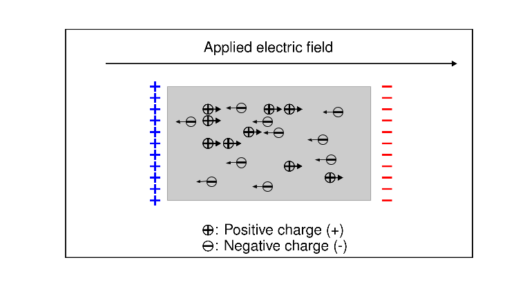

.. _electrical_conductivity_index:

Electrical Conductivity
=======================

.. purpose::

    Using any electromagnetic geophysical survey we excite the earth, and
    measure signals from the earth. Measured EM signals is mostly depending
    upon electrical conductivity contrasts of earth materials. Therefore,
    understanding ...

Electrical conductivity is a physical property that quantifies how well
electrical charges move in a given material when subjected to an applied
electric field. In mathematical development and in references describing rocks
or fluids, it is common to refer to its reciprocal, resistivity.

Conductivity is often frequency-dependent.  Effectively the material can act
like a capacitor and build up a charge when an electric field is applied, that
is, the material is "chargeable". The ability to accumulate charge,  called
"chargeability" is so important in geophysics that it is often considered as
another physical property. In this section we connect electrical conductivity
with some of its applications through case histories, investigate the
constitutive relationship and its laboratory foundation, compile useful tables
and provide additional levels of information that are valuable.  See
:ref:`these tables <electrical_conductivity_tables>` for conductivity and
chargeabiltiy of various rocks.

As shown in :numref:`Chargeflow`, positive charges in a rock flow in the same
direction as the electric field. In a circuit that involves a battery, the
charges move from the positive to negative potential. The electric current is
how much charges move within a unit of time. A high conductivity means a
material that readily allows the flow of electric current. This constitutive
relationship between electric currents and fields can be written as

.. math::
  \mathbf{J} = \sigma \mathbf{E},

where :math:`\sigma` (S/m) is conductivity,  :math:`\mathbf{J}` (A/m :math:`^2`) is electric currents, :math:`\mathbf{E}` (V/m) electric fields.

   Flow of charges under an applied electric field.

.. note::

    Chargeability is often listed as an independent physical property
    (such as density, magnetic susceptibility) and we will continue with that
    in this EM resource. It is however, just an element that is necessary in
    order to provide a complete description of electrical conductivity.

Applicability
-------------

.. todo::

    Add thumbnail figure

Where is it diagnostic?
-----------------------

.. todo::

    Add thumbnail figure

Contents
--------

.. toctree::
    :maxdepth: 2

    electrical_conductivity_lab_setup_measurements
    electrical_conductivity_tables
    relevanttopics/index
    electrical_conductivity_mathematical_relationships

