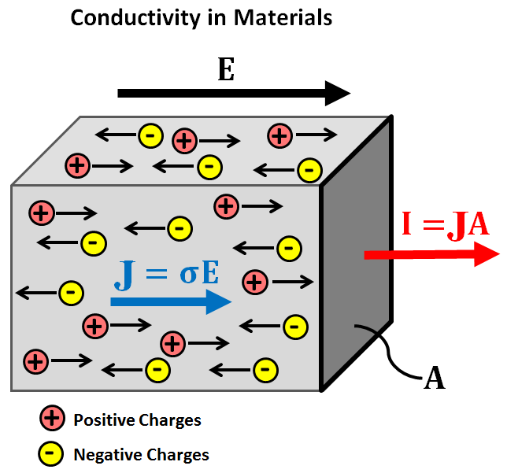
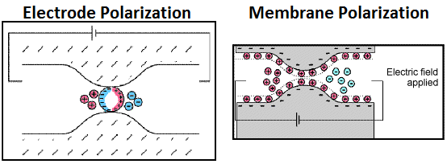
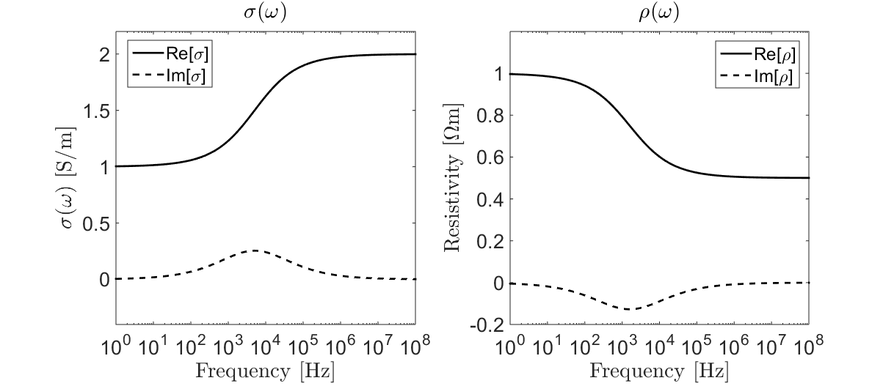

.. _electrical_conductivity_index:

Electrical Conductivity
=======================

Electrical conductivity is a diagnostic physical property that quantifies how easily electrical charges move through a given material when subjected to an applied electric field. In mathematical development and in references describing rocks or fluids, it is common to use its reciprocal, electrical resistivity. For most of the :ref:`geophysical surveys <geophysical_surveys_index>` described within EM geosci, electrical conductivity is the primary diagnostic physical property.

Constitutive Relationship
-------------------------

When an electric field is applied to a material, free charges within the material experience an electrical (Coulomb) force. This force causes the free charges to move through the material along the direction of the applied field (i.e. electrical current). The ease at which electrical charges move through a material under the influence of an electric field depends on the material's electrical conductivity.

   Flow of electrical charges under an applied electric field.

Electrical conductivity :math:`\sigma` defines the ratio between the current density :math:`\mathbf{J}` within a material and the electric field :math:`\mathbf{E}`. This relationship is known as Ohm's law and is given by:

.. math::
  \mathbf{J} = \sigma \mathbf{E}

where the current density is defined as the electrical current :math:`\mathbf{I}` per unit cross-sectional area :math:`A` (:numref:`fig_conductivity_physics_diagram`):

.. math::
  \mathbf{J} = \lim_{A \rightarrow 0} \frac{\mathbf{I}(A)}{A}

Electrical Resistivity
----------------------

In many cases, the electrical properties of a material are characterized using the electrical resistivity :math:`\rho`. Electrical resistivity is defined as the reciprocal of the electrical conductivity:

.. math::
  \rho = \frac{1}{\sigma}

Thus the constitutive relationship can be re-expressed as follows:

.. math::
  \mathbf{E} = \rho \mathbf{J}

Chargeability and Frequency-Dependence
--------------------------------------

Under the influence of an electric field, free charges (such as ions) flow through materials along the direction of the applied field. However when ionic charges reach an impermeable barrier, they begin to accumulate. Thus certain materials can act as capacitors for ionic charges; a phenomenon known as induced polarization. Below are two examples of induced polarization in rocks. On the left, ionic charges accumulate because the pore path is blocked by metallic particles (electrode polarization). On the right, ionic charges accumulate because the pore throat is insufficiently large (membrane polarization).

The degree of charge accumulation (capacitance) under the influence of an external electric field is described as **chargeability**. Chargeability is frequently considered a separate physical property from conductivity, although the two are related. For chargeable materials, the constitutive relationship (Ohm's law) becomes frequency-dependent:

.. math::
  \mathbf{J}(\omega) = \sigma (\omega) \mathbf{E}(\omega) 

A commonly used model for describing frequency-dependent conductivity is the Cole-Cole model:

.. math::
  \sigma (\omega) = \sigma_{\infty} \Bigg [ 1 - \frac{\eta}{1 + (1-\eta)(i \omega \tau)^C} \Bigg ]

where :math:`\sigma_{\infty}` is the infinity frequency limit, :math:`0 \leq \eta \leq 1` is the **chargeability**, and :math:`\tau` and :math:`0 \leq C \leq 1` define the rate of charge accumulation. After taking the reciprocal, the electrical resistivity is commonly expressed as:

.. math::
  \rho (\omega) = \rho_0 \Bigg [ 1 - \eta \Bigg ( 1 - \frac{1}{1 + (i\omega \tau)^C} \Bigg ) \Bigg ]

where :math:`\rho_0` defines the zero-frequency, or DC, resistivity. The conductivity and resitivity as a function of frequency are illustrated below.

   Cole-Cole conductivity (left) and resistivity (right) for :math:`\sigma_\infty` = 2 S/m, :math:`\rho_0` = 1 :math:`\Omega m`, :math:`\eta` = 0.5, :math:`\tau` = :math:`10^{-4}` s and :math:`C` = 0.5.

Relevance to Geophysical Applications
-------------------------------------

**Electrical Conductivity**

The majority of EM surveys exploit contrasts in electrical conductivity to image the subsurface. During :ref:`direct current resistivity <dcr_index>` (DCR) surveys for example, electrical current is forced through the Earth. The path taken by the current, as well as the measured data, depend on the subsurface conductivity distribution.

Many EM systems operate on the principles of EM induction. These include: :ref:`frequency-domain EM <airborne_fdem_index>` (FDEM), :ref:`time-domain EM <airborne_tdem_index>` (TDEM), :ref:`marine controlled source EM <marine_csem_index>` (CSEM) and :ref:`unexploded ordnance <uxo_index>` (UXO) surveys. During these surveys, a transmitter sends time-varying EM signals into the ground which subsequently induce electric currents. The strength of the induced currents and the secondary fields they produce are dependent on the distribution of subsurface conductivity.

Data collected during :ref:`magnetotelluric <mt_index>` (MT) and :ref:`Z-axis Tipper EM <ztem_index>` (ZTEM) also depend on the conductivity of the Earth. These methods rely on natural sources to generate EM responses. For MT, the relationships between measured components of the electric and magnetic fields provide insight regarding the Earth's electromagnetic impedance, and indirectly its electrical condutivity.

**Chargeability**

In comparison to most other rock types, sulphide-bearing rocks are highly chargeable; one exception being rock's with a high clay content. In sufficient concentrations, sulphide-bearing rocks can have significant economic value. Unlike :ref:`DCR surveys <dcr_index>`, :ref:`IP surveys <ip_index>` can be used to distinguish chargeable and non-chargeable bodies, even if both are similarly conductive. :ref:`TDEM systems <airborne_tdem_index>` can also be used to recognize the presence of chargeable bodies, as they produce distinct time-domain responses. 

**Contents**

.. toctree::
    :maxdepth: 1

    electrical_conductivity_lab_setup_measurements
    electrical_conductivity_tables
    relevanttopics/index
    electrical_conductivity_mathematical_relationships

.. Conductivity is often frequency-dependent. Effectively the material can act
.. like a capacitor and build up a charge when an electric field is applied, that
.. is, the material is "chargeable". The ability to accumulate charge,  called
.. "chargeability" is so important in geophysics that it is often considered as
.. another physical property. In this section we connect electrical conductivity
.. with some of its applications through case histories, investigate the
.. constitutive relationship and its laboratory foundation, compile useful tables
.. and provide additional levels of information that are valuable.  See
.. :ref:`these tables <electrical_conductivity_tables>` for conductivity and
.. chargeabiltiy of various rocks.

.. As shown in :numref:`Chargeflow`, positive charges in a rock flow in the same
.. direction as the electric field. In a circuit that involves a battery, the
.. charges move from the positive to negative potential. The electric current is
.. how much charges move within a unit of time. A high conductivity means a
.. material that readily allows the flow of electric current. This constitutive
.. relationship between electric currents and fields can be written as

