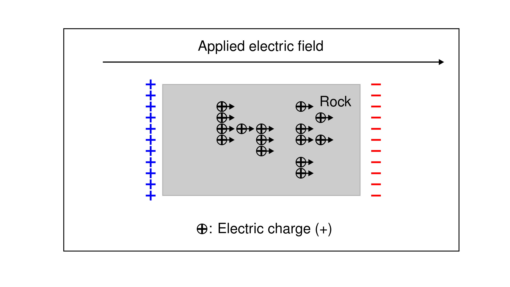
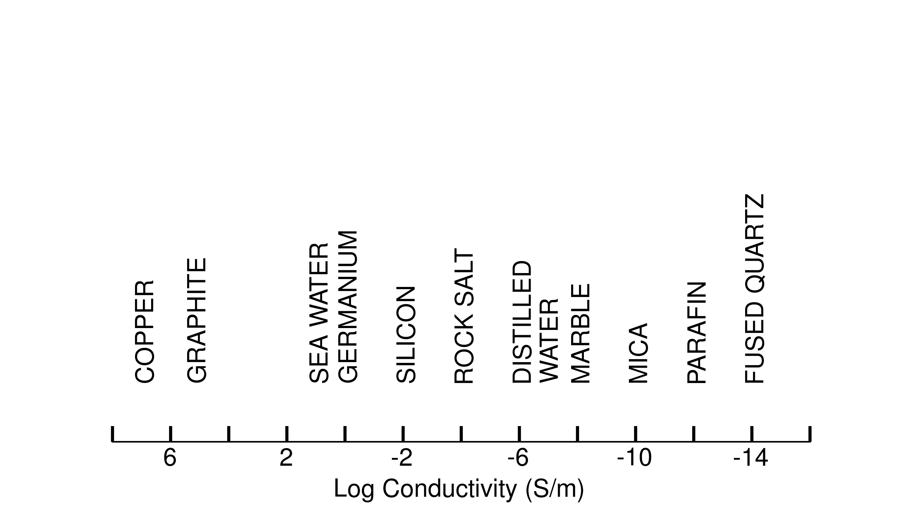

.. _electrical_conductivity_index:

Electrical Conductivity
=======================

..todo:: link same iconic figure used in introduction to em.geosci when conductivity is mentioned. use one for conductivity and another for chargeabilty

..Purpose:: 
  Electrical conductivity is a physical property that quantifies how well electrical charges move in a given material when subjected to an applied electric field. In mathematical development and in references describing rocks or fluids, it is common to refer to its reciprocal, resistivity. Conductivity is often frequency-dependent.  Effectively the material can act like a capacitor and build up a charge when an electric field is applied, that is, the material is "chargeable". The ability to accumulate charge,  called :ref:`"chargeability"< is so important in geophysics that it is often considered as another physical property. In this section we connect electrical conductivity with some of its applications through case histories, investigate the constitutive relationship and its laboratory foundation, compile useful tables and provide additional levels of information that are valuable. 

.. toctree::
    :maxdepth: 2

    Case Histories
    Constitutive relationship and laboratory experiment 
    Useful tables
    Additional information
    References
  

As shown in :numref:`Chargeflow` positive charges in a rock flow in the same direction as the electric field. In a circuit that involves a battery the charges move from the positive to negative potential. The electric current is how much charges move within a unit of time, a high conductivity means a material that readily allows the flow of electric current. In geophysics, conductivity is usually represented by the Greek letter :math:`\sigma` (S/m).

Electrical resistivity is the reciprocal of electrical conductivity, and material’s ability to oppose an electric current. It is usually represented by the Greek letter :math:`\rho` (:math:`\Omega`-m) in geophysics.

   Flow of charges under an applied electric field.

The electrical charge is mostly carried by ions and electrons (charge carriers). Mobilities of the charge carriers vary dynamically resulting in diverse range for the conductivity of a material from highly conducting metals to nearly perfect insulators as shown in :numref:`LogCond`.

   Figure Captions Various conductivity values for different materials.

.. todo:: where is it diagnostic?

.. Electrical conductivity is a physical property that describes how easily
.. electric currents can flow through a medium. Conductivity, and its reciprocal,
.. "resistivity", are used interchangeably. The conductivity of earth materials
.. depends on many factors but primarily upon mineral content, porosity,
.. saturating fluids, connecting paths and temperature.

.. Seogi Not sure we need to comment here. Rather, we have a section for complex conductivity

.. note::
    Chargeabilty is often listed as an independent physical property
    (such as density, magnetic suspectibilty) and we will continue with that
    in this EM resource. It is however, just an element that is necessary in
    order to provide a complete description of electrical conductivity.

**Contents**

 

