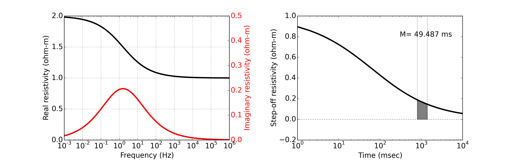

.. _electrical_conductivity_mathematical_relationships_ColeColeresistivity:

Cole Cole Resistivity
=====================

To explain chargeability, we used "over-voltage" effects due to the polarization build-up under the external electric field. This often called induced polarization phenomenon, and can be mathematically formulated using a complex resistivity model in frequency domain. This will include more IP parameters than the chargeability and we will explore those through a simple complex resistivity model.

The electrical resistivity of a material can depend upon frequency. In Ohm's Law, :math:`\mathbf{J} = \sigma\mathbf{E}`, :math:`\sigma` is a complex number.
There is no simple mathematical formula that describes the relation between conductivity and frequency but one that has some practical use is the Cole-Cole model, which describes dispersive dielectric constant :cite:`cole1941`. :cite:`pelton1978` modified this for resistivity which can be written as

.. math::
    \rho(\omega) = \rho_0 \Big[1 - \eta \Big(1-\frac{1}{1+(\imath\omega\tau)^c}\Big) \Big],
    :label: colecole_pelton_res

where :math:`\rho_0` is resistivity at zero frequency, :math:`\eta` is chargeability, :math:`\tau` (s) is a time constant, :math:`c` is a frequency dependency. :math:`\eta` is the "chargeability" (dimensionless :math:`0\le\eta<1`); :math:`\eta` is often related to the concentration of a chargeable mineral, for instance :math:`\eta` is related to the total percentage of sulfide minerals. :math:`\tau` is a time constant generally thought to be related to grain size; :math:`c` is a variable associated with distribution of grain size.

Left panel of :numref:`colecole_resis` shows Cole-Cole resistivity with parameters: :math:`\eta=0.5`, :math:`\tau=0.1` s, :math:`c=0.5`, :math:`\rho_{\infty}=1` ohm-m.

   Cole-Cole resistivity response. Left and right panels show frequency and time domain responses. Time domain response assumed step-off current waveform. M indicates pseudo-chargeability computed within an example window (800-1400 msec).
