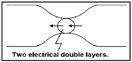

.. _electrical_conductivity_characteristicsIP_electrodepolarization:

Electrode polarization
======================

Electrode polarization occurs when pore space is blocked by metallic
particles. Again, charges accumulate when an electric field is applied.

 .. figure:: ../figures/elec_pol_1.gif
	:align: center
	:scale: 100 %

The result is two electrical double layers which add to voltages measured at
the surface.

Comments on electrode polarization
----------------------------------

 .. figure:: ../figures/elec_pol_3.gif
	:align: right
	:scale: 100 %

Some remarks are appropriate here in order to provide some sense of the
complexity of the chargeability phenomenon.

At an interface between ionic and metallic conduction (for example, an ore
grain in pore water), there is an impedance involved in getting current to
flow across the barrier. These interfaces look like the top figure and have
the simplified circuit analogue shown in the bottom figure.

 .. figure:: ../figures/elec_pol_4.gif
	:align: right
	:scale: 100 %

Current can flow via charge transfer (or ion diffusion), which involves
electrochemical processes, or via a capacitive effect (no charge transfer),
involving diffusion currents.

Ion diffusion is not easy to model with circuit elements. The process is
called the Warburg impedance. Its magnitude varies as approximately
1/frequency.

Note that, while it is useful to understand simplified models of the relevant electrical behavior of surface-electrolyte interactions, all rocks are, in fact, "dirty" in the sense that they are not simply pure "electrodes" (semi-conducting mineral grains) and electrolytes (pore solutions).  There are other materials and particles affecting ionic behavior within and outside the diffuse layer, and some of the sample's constituents will affect the behavior of the fixed layer near and on the liquid-solid interfaces.
