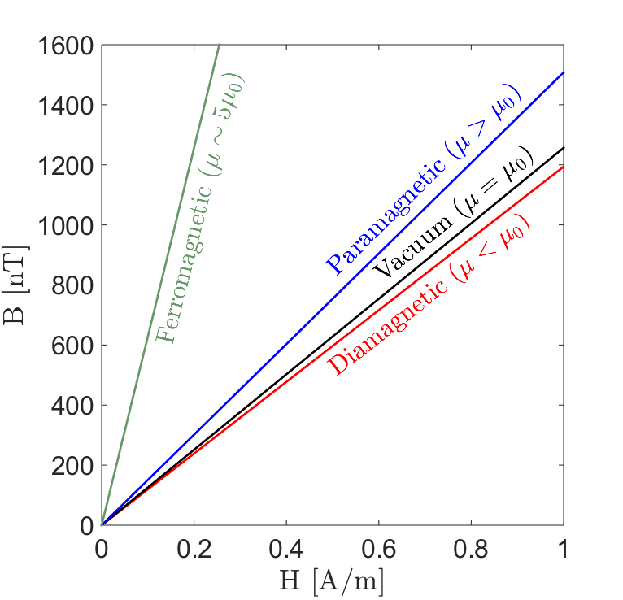
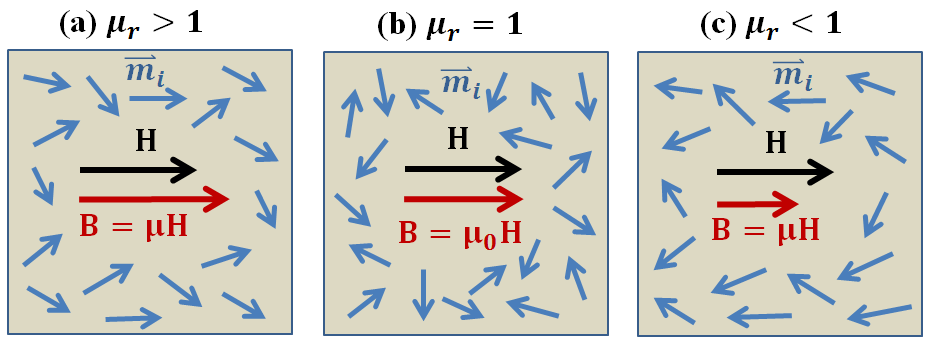

.. _magnetic_permeability_index:

Magnetic Permeability
=====================

Magnetic permeability is a diagnostic physical property which characterizes the degree of induced magnetism a material experiences under the influence of an external magnetic field. Magnetic permeability is relevant to a variety of geophysical surveys, including: frequency-domain EM (FDEM), time-domain EM (TDEM), unexploded ordnance (UXO) and ground-penetrating radar (GPR).

Constitutive Relationship
-------------------------

When exposed to an applied magnetic field, the collection of individual
magnetic dipole moments within most materials will attempt to reorient
themselves along the direction of the field. This generates an induced
magnetization, which contributes towards the net magnetic flux density inside
the material. The degree in which the induced magnetization impacts the
magnetic flux density depends on the material's magnetic permeability.

    Magnetic flux density as a function of magnetic field intensity for
    various classifications of permeable rock types: diamagnetic, vacuum,
    paramagnetic, and ferromagnetic.

Magnetic permeability :math:`\mu` defines the ratio between the magnetic flux
density :math:`{\bf B}` within a material, and the intensity of an applied
magnetic field :math:`{\bf H}`; provided the fields are sufficiently weak:

.. math::
    {\bf B}(\omega) = \mu \, {\bf H}(\omega)
    :label: Const_Rel_Flux

In a vacuum, the relationship between :math:`{\bf B}` and :math:`{\bf H}` is
given by the permeability of free-space :math:`\mu_0 = 4\pi \times 10^{-7}` H/m. An illustration representing the magnetic flux density
as a function of the applied field strength for various rock classifications is shown here.

Relative Permeability
---------------------

In addition to the magnetic permeability, magnetic properties are frequently
represented using the relative permeability. Relative permeability
characterizes whether the induced magnetization increases or reduces the
density of magnetic flux within a material. The relative permeability
:math:`\mu_r` is the ratio between the magnetic permeability of a material and
the permeability of free-space:

.. math::
    \mu_r = \frac{\mu}{\mu_0}
    :label: Rel_Permeability

For the majority of rocks, induced magnetization is parallel to the applied
field, thus adding to the density of magnetic flux. These rocks are
characterized by relative permeabilities :math:`\mu_r > 1`. A relative
permeability of :math:`\mu_r = 1` is used to characterize materials which are
incapable of supporting induced magnetization. In rare cases, a very small
magnetization can be induced in rocks, which opposes the applied field, and
reduces the density of magnetic flux. These rocks are characterized by
magnetic permeabilities :math:`\mu_r < 1`.
The partial alignment of magnetic dipole moments under an applied field, and
the resulting magnetic flux densities in all three cases, are represented in
the figure below.

    Partial alignment of magnetic dipole moments under the influence of an
    applied magnetic field for various cases. (a) Paramagnetic (:math:`\mu_r > 1`).
    Magnetization is parallel to the applied field and increases the density
    of magnetic flux. (b) Non-permeable (:math:`\mu_r = 1`).
    Does not support induced magnetization. (c) Diamagnetic (:math:`\mu_r < 1`).
    Magnetization is weak and opposes the applied magnetic field, thus reducing
    the density of magnetic flux.

Relevance to Geophysical Applications
-------------------------------------

**Inductive Source EM Systems**

In most geological environments, variations in the Earth's magnetic permeability are insignificant (:math:`\mu \sim \mu_0`) and surveys are only sensitive to contrasts in the Earth's electrical conductivity. However, there are a variety of cases where magnetic permeability becomes an important diagnostic physical property. For example, some ore-bearing rocks (magnetite, pyrrhotite) have very high magnetic permeabilities. When using frequency-domain (FDEM) and time-domain (TDEM) electromagnetic systems, large magnetic permeabilities have been shown to impact the measured response. Thus failure to account for the Earth's magnetic properties can result in a mis-characterization of subsurface structures in certain environments. 

**Unexploded Ordnance Surveys**

Magnetic permeability is also a diagnostic physical property for unexploded ordnance (UXO) surveys. An unexploded ordnance (UXO) is a munition that was armed, fired and remains unexploded through malfunction. UXO casings are extremely permeable in comparison to the host medium. This contrast can be exploited in order to locate an remove UXOs from contaminated areas. The UXO's magnetic properties are also responsible for producing distinct TDEM responses. 

**Ground Penetrating Radar**

Magnetic permeability acts as a secondary diagnostic physical property in ground penetrating radar (GPR). Magnetic permeability impacts the reflection, refraction and velocity of radiowave signals as they propagate through the Earth.

**Magnetic Viscosity**

Magnetic viscosity refers to a dispersive magnetic permeability which is exhibited by lateritic soils and rapidly cooled basalts. When using TDEM systems, these rocks produce a response which masks the responses from UXOs and deeply buried conductors. Currently, methods are being developed to model this phenomenon and its response from field collected data.

**Contents**

 .. toctree::
    :maxdepth: 1

    magnetic_permeability_lab_measurements
    magnetic_permeability_units
    magnetic_permeability_values
    magnetic_permeability_magnetism
    magnetic_permeability_factors
    magnetic_permeability_frequency_dependent

