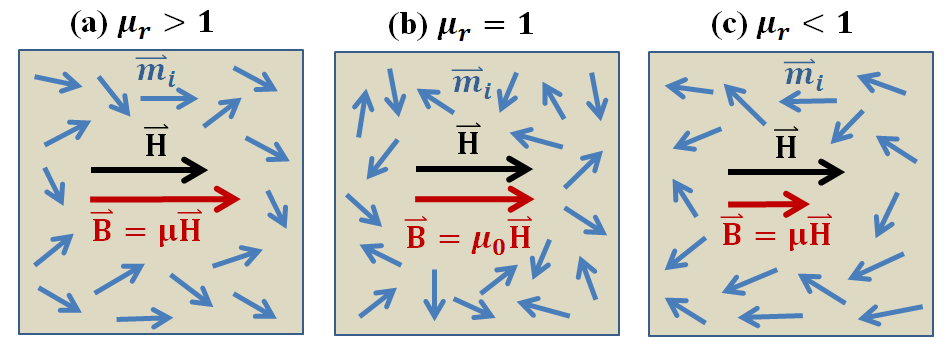

.. _magnetic_permeability_index: 

Magnetic Permeability
=====================

Magnetic permeability :math:`\mu` is the ratio between the magnetic flux density :math:`{\bf B}` within a material, and the intensity of an applied magnetic field :math:`{\bf H}`; provided the fields are sufficiently weak:

.. math::
	{\bf B}(\omega) = \mu \, {\bf H}(\omega)
	:label: Const_Rel_Flux

When exposed to an applied magnetic field, the individual magnetic dipole moments within most materials will attempt to reorient themselves along the direction of the field.
This generates an induced magnetization, which impacts the density of magnetic flux inside the material.
The degree in which the induced magnetization contributes towards the magnetic flux density depends on the material's magnetic permeability.

DIAGNOSTIC
Magnetic permeability represents an important diagnostic property in geophysics.
The magnetic permeability of materials contained within unexploded ordnance items are frequently orders of magnitude larger than the soil they are buried in.
HOW WE USE IT

In addition to the magnetic permeability, a material's magnetic properties can be represented using the relative permeability :math:`\mu_r`:

.. math::
	\mu_r = \frac{\mu}{\mu_0}
	:label: Rel_Permeability
	
where :math:`\mu_0 = 4\pi \times 10^{-7}` T :math:`\!\cdot\!` m/A is the permeability of free-space.
The majority of rocks are paramagnetic.
In paramagnetic materials, the induced magnetization is parallel to the applied field.
The relative permeability of these materials are characterized by :math:`\mu_r > 1`.
A relative permeability of :math:`\mu_r = 1` is used to characterize materials which are incapable of supporting induced magnetization.
In rare cases, the application of a magnetic field induces an anti-parallel magnetization.
These materials are characterized by relative permeabilities :math:`\mu_r < 1`.
The alignment of magnetic dipole moments, and the resulting magnetic flux density in all three cases, are shown in Figure.

**Contents:**

 .. toctree::
    :maxdepth: 2

    magnetic_permeability_lab_measurements
    magnetic_permeability_units_values
    magnetic_permeability_magnetism
    magnetic_permeability_factors

References: Rock and Mineral Properties: Keller SEG Vol 1 Electromagnetic Methods in Applied Geophysics
