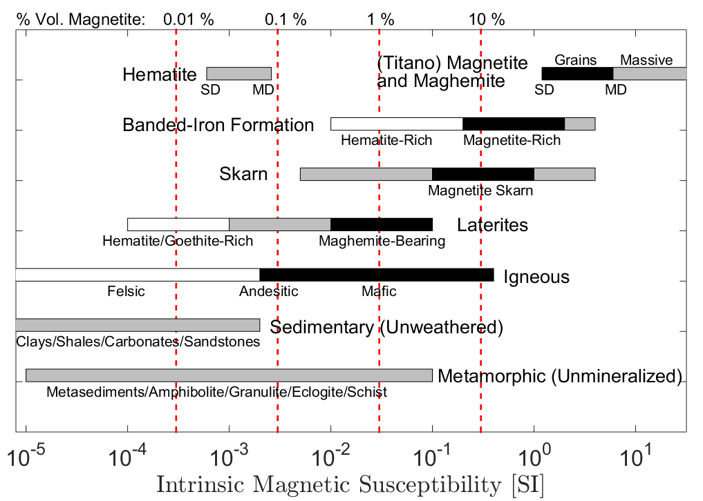

.. _magnetic_permeability_factors:

Factors which Affect a Rock's Magnetic Properties
=================================================

The typical range of intrinsic magnetic susceptibilities for various rock types are shown in Figure (needs reference).
Magnetism in rocks is primarily attributed to the presence of iron-bearing minerals.
Magnetite, titano-magnetite and maghemite are ferrimagnetic minerals, and exhibit very strong induced magnetization; with magnetite being the most susceptible.
Even in small abundances, these iron-oxide minerals frequently represent the dominant contribution towards a rock's magnetic susceptibility.
Certain sulfide minerals, such as pyrrhotite and greigite, are also ferrimagnetic and capable of experiencing strong induced magnetization.
Other iron-bearing minerals may be weakly paramagnetic.
If sufficiently abundant however, they offer a secondary contribution towards the rock's magnetic susceptibility.
Notable paramagnetic minerals include: lepidocrosite, dolomite, biotite, siderite, and fayalite.
Anti-ferrimagnetic minerals, most notably hematite, exhibit extremely weak induced magnetization.
As a result, their contribution is considered more or less negligible; goethite is one of the few exceptions.

The magnetic susceptibility of a rock ultimately depends on its mineralogy.
Rocks containing higher abundances of magnetite, titano-magnetite and maghemite are more susceptible.
Magnetite is frequently the dominant source of magnetic susceptibility in rocks.
A rough estimate of magnetic susceptibility based on \% volume magnetite content is shown along the top of Figure (needs reference).
Felsic igneous rocks are characterized as having a lower iron content than mafic rocks.
As a result, their magnetic susceptibilities are frequently smaller in comparison.
The magnetic susceptibility of a sedimentary rock depends on the mineralogy of its parent material as well as its weathering history.
Clays, shales, carbonates and sandstones are not typically susceptible.
In laterites, weathering has leached out more soluble minerals, leaving behind minerals which are rich in iron and aluminium.
Laterities therefore have the potential to be somewhat susceptible.
Banded-iron formations are a class of sedimentary rock, characterized by alternating layers of chert/shale and magnetite/hematite.
Magnetite-rich banded-iron formations are one of the most susceptible rock types.
Metamorphism changes the mineral composition of pre-existing rock by supplying heat, pressure and chemically active fluids.
Some rocks become enriched with magnetite and pyrrhotite during metamorphism, making them more susceptible.
Skarns and mineralized veins frequently exhibit high magnetic susceptibilities.
In general, unmineralized metamorphic rocks exhibit a broad range of magnetic susceptibilities.
These rocks include: metasediments, amphibolites, granulites, eclogites and schists.