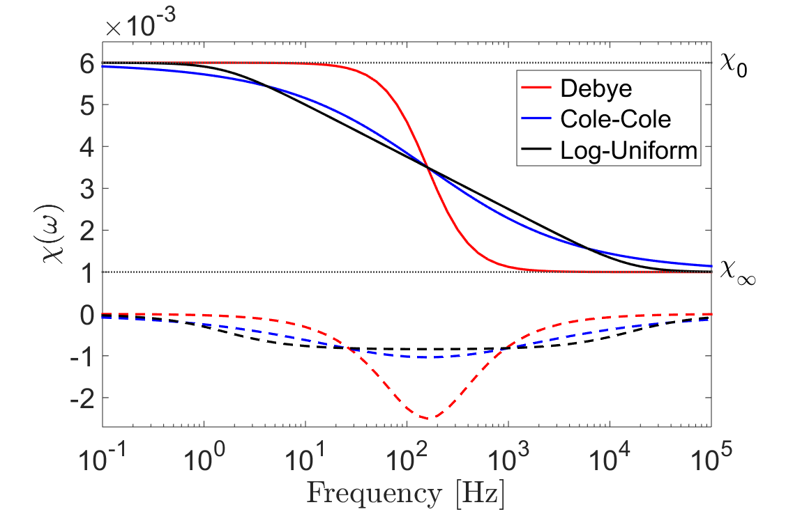

.. _magnetic_permeability_frequency_dependent:

Frequency-Dependent Magnetic Permeability
=========================================

In response to changes in an applied magnetic field, the induced magnetization within most rocks may be considered an instantaneous process.
For some lateritic soils and rapidly cooled basalts however, a portion of the induced magnetization undergoes a relaxation process.
This relaxation process is commonly refered to as: viscous remanent magnetization, magnetic viscosity, or magnetic after-effect.
As a result of their magnetic viscosity, lateritic soils and rapidly cooled basalts are characterized by frequency-dependent magnetic permeabilities.

Here, our description of the magnetic viscosity is limited to providing useful expressions for implementation in applied problems.
Comprehensive studies of magnetic viscosity, and its relevance to geophysical surveying, may be found in (Neel, 1949; Buselli, 1982; Lee, 1984; Dabas, 1992; Dunlop and Ozdemir, 1997; Das, 2006; Pasion, 2007).
References may be found at the bottom of the page.

Mathematical Description
------------------------

For rocks which are characterized by frequency-dependent magnetic permeabilities, the :ref:`magnetic constitutive relationship <magnetic_permeability_index>` becomes:

.. math::
	{\bf B}(\omega) = \mu (\omega) \, {\bf H}(\omega)
	:label: FreqConstRel

where :math:`\mu (\omega)` may also be characterized a frequency-dependent magnetic susceptibility :math:`\chi (\omega)`:

.. math::
	\mu (\omega) = \mu_0 \big [ 1 + \chi (\omega) \, \big ]
	:label: SuscPermRel

As presented :ref:`earlier <magnetic_permeability_magnetism>`, magnetic susceptibility represents the proportional degree of induced magnetization, in response to an applied magnetic field.
For rocks exhibiting magnetic viscosity, the relaxation process may be understood by considering a Debye model:

.. math::
	\chi(\omega) = \chi_\infty + \frac{\chi_0 - \chi_\infty}{1 + i \omega \tau}
	:label: EqDebye

where :math:`\chi_0` defines the zero-frequency limit, :math:`\chi_\infty` defines the infinite frequency limit, and :math:`\tau` defines the rate of magnetic relaxation.
The instantaneous portion of induced magnetization is represented by :math:`\chi_\infty`, whereas :math:`\chi_0-\chi_\infty` represents the viscous contribution.
In rocks, the magnetic viscosity is characterized by a distribution of time-relaxation constants.
This can be represented by introducing a weighting function :math:`f(\tau)`, and integrating over all Debye models:

.. math::
	\chi (\omega) = \chi_\infty + \big ( \chi_0 - \chi_\infty \big ) \int_0^\infty \frac{f(\tau)}{1 + i\omega\tau} d\tau
	:label: EqWeigthFcn

The magnetic viscosity of a rock ultimately depends on the distribution of time relaxation constants.
From expression :eq:`EqWeigthFcn`, a multitude of models have been proposed.
One of the simplest and most popular models is obtained by assuming a log-uniform distribution of time relaxation constants:

.. math::
	\chi(\omega) = \chi_0 - \frac{\chi_0 - \chi_\infty}{ln (\tau_2/\tau_1)} ln \Bigg ( \frac{1 + i\omega\tau_2}{1 + i\omega\tau_1} \Bigg )
	:label: EqLogUniform

where :math:`\tau_1` and :math:`\tau_2` represent lower and upper bounds for distribution.
A specific weighting function may also be used to obtain the Cole-Cole model:

.. math::
	\chi(\omega) = \chi_\infty + \frac{\chi_0 - \chi_\infty}{1 + (i \omega \tau_c)^\alpha}
	:label: EqColeCole

where :math:`\tau_c` represents the center of a distribution of time-relaxation constants, and :math:`\alpha` represents the broadness of the distribution.
The frequency-dependent magnetic susceptibilities for a Debye model, log-uniform distribution, and Cole-Cole model are compared in the figure below.

	Comparison between frequency-dependent magnetic susceptibilities for a Debye model (:math:`\chi_0=6\times 10^{-3}, \; \chi_\infty = 10^{-3}`), a log-uniform distribution of time-relaxation constants (:math:`\chi_0=6\times 10^{-3}, \; \chi_\infty = 10^{-3}, \tau_1=10^{-5} \; s, \tau_2 =10^{-1} \, s`), and a Cole-Cole model (:math:`\chi_0=6\times 10^{-3}, \; \chi_\infty = 10^{-3}, \tau_c = 10^{-3} \, s, \alpha = 0.5`).

References:

L. Neel, "Theorie du trainage magnetique des ferromagnetiques en grains fins avec application au terres cuites," Ann. Geophys., vol. 5, pp. 99-136, 1949.

G. Buselli, "The effect of near-surface superparamagnetic material on electromagnetic measurements," Geophysics, vol. 47, no. 9, pp. 1315-1324, Sep 1982.

T. Lee, "The Effect of a Superparamagnetic Layer on the Transient Electromagnetic Response of a Ground," Geophysical Prospecting, vol. 32, pp. 480-496, 1984.

M. Dabas, A. Jolivet, A. Tabbagh, "Magnetic susceptibility and viscosity of Soils in a Weak Time Varying Field," Geophys. J. Int., vol. 108, pp. 101-109, 1992.

D. Dunlop, O. Ozdemir, "Rock Magnetism: Fundamentals and Frontiers," Cambridge University Press, 1997.

Y. Das, "Effects of soil electromagnetic properties on metal detectors," IEEE Trans. Geosci. Remote Sensing, vol. 44, pp. 1444-1453, Jun 2006.

L. R. Pasion, "Inversion of Time Domain Electromagnetic Data for the Detection of Unexploded Ordnance," Ph.D. dissertation, Univ. of British Columbia, Geophysics Dept., Vancouver, 2007.

