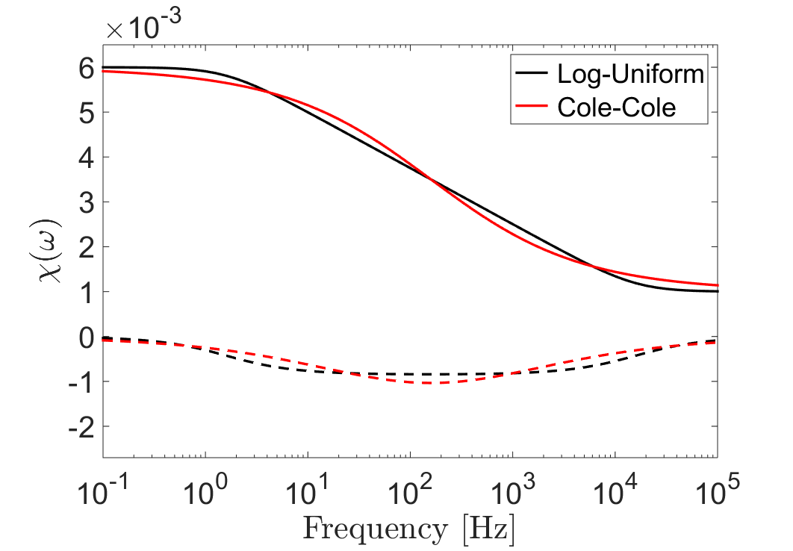

.. _magnetic_permeability_frequency_dependent:

Frequency-Dependent Magnetic Permeability
=========================================

Summary
-------

.. math::
	{\bf B}(\omega) = \mu (\omega) \, {\bf H}(\omega)
	
	
.. math::
	\mu (\omega) = \mu_0 \big [ 1 + \chi (\omega) \, \big ]

.. math::
	\chi(\omega) = \chi_0 - \frac{\chi_0 - \chi_\infty}{ln (\tau_2/\tau_1)} ln \Bigg ( \frac{1 + i\omega\tau_2}{1 + i\omega\tau_1} \Bigg )
	

.. math::
	\chi(\omega) = \chi_\infty + \frac{\chi_0 - \chi_\infty}{1 + (i \omega \tau)^C}

Background Theory
-----------------

