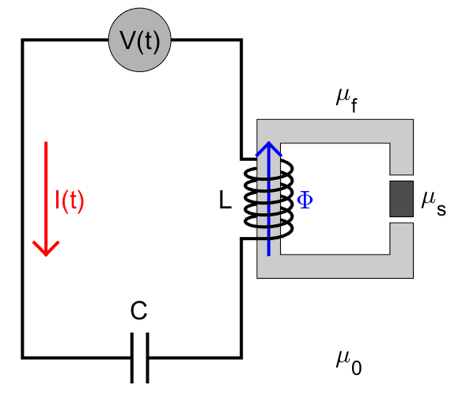
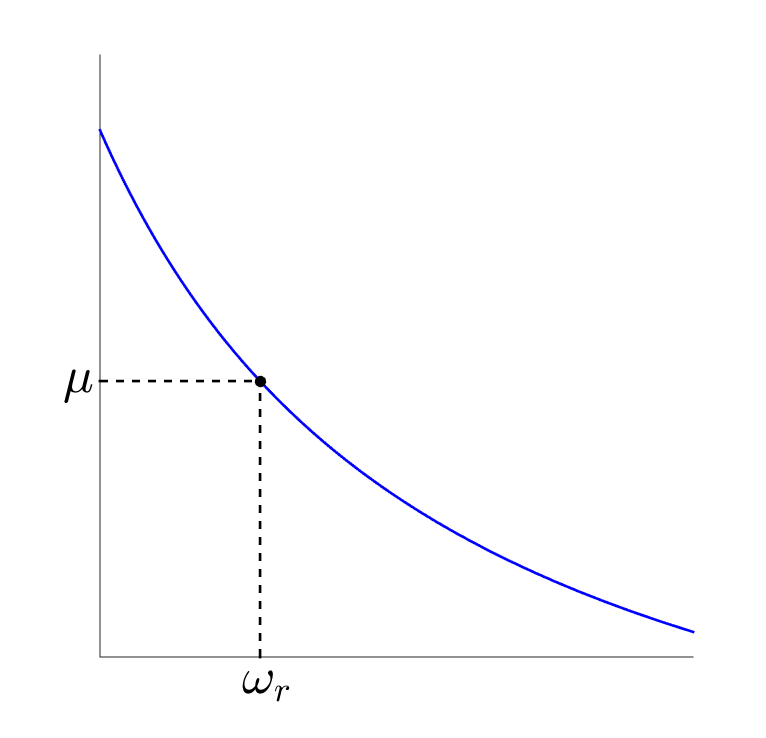

.. _magnetic_permeability_lab_measurements:

Laboratory Measurements
=======================

Magnetic permeability measurements are an integral part of classifying physical rock properties.
Here, we present the general approach for measuring a rock's magnetic permeability.
Background theory is then provided for a simplified instrument configuration.

General Approach
----------------

        Electrical circuit diagram representing a simplified instrument configuration. The inductive element :math:`L` depends on the magnetic permeability of the sample :math:`\mu_s`.
        
Magnetic permeability measurements can be understood by considering the forced, in-series LC circuit diagram in Figure.
The current :math:`I(t)` within the wire is generated by a driving voltage :math:`V(t)`.
This current is defined by the following ordinary differential equation:

.. math::
	\frac{d^2 I (t)}{d t} + \frac{1}{LC} I(t) = F(t)
	:label: Forced_Oscillator
	
	
For our circuit, the inductive element :math:`L` depends on the magnetic permeability :math:`\mu_s` of the rock sample.
This relationship is discussed more in the following section.
:math:`C` represents a known capacitive element, and :math:`F(t)` is used to represent the driving voltage.
From Eq. :eq:`Forced_Oscillator`, the circuit has a natural resonance frequency :math:`\omega_r` at:

.. math::
	\omega_r = \frac{1}{\sqrt{LC}}
	:label: Omega_Resonance

        Representation of an experimentally derived curve, for a particular instrument, which characterizes an empirical relationship between :math:`\mu_s` and :math:`\omega_r`.

Since :math:`C` is known, Eq. :eq:`Omega_Resonance` implies there exists an explicit relationship between :math:`\omega_r` and :math:`\mu_s`.
Unfortunately, this relationship is not particularly straightforward, and depends on the configuration of the instrument.
In most cases, an experimentally derived curve is used to characterize an empirical relationship between :math:`\omega_r` and :math:`\mu_s`.
Once established, the magnetic permeability of a sample may be obtained by 1) determining the resonance frequency of the circuit, then 2) finding the corresponding magnetic permeability value on the curve (Clark and Emerson, 1991). 
This is illustrated in Figure ().

        
Background Theory: A Simplified Experiment
------------------------------------------

Once again, let us consider our in-series LC circuit.
For sensitive permeability measurements, a portion of the wire is frequently wound around a ferrite.
Ferrites are non-conductive and extremely permeable (:math:`\mu_{f} \sim 1000\mu_0`).
As a result, they become extremely magnetized when exposed to a magnetic field, but experience negligible EM induction under 5 kHz (Clark and Emerson, 1991).
The ferrite does not form a closed path.
Within the gap, a rock of magnetic permeability :math:`\mu_s` is placed.
The coil-ferrite system acts as an inductive element for the circuit, and is denoted by :math:`L`.
Thus, the current within the wire can be describe using Eq. :eq:`Forced_Oscillator`.

The driving voltage :math:`V(t)` generates a current :math:`I(t)` within the wire.
This current creates a magnetic field :math:`H` within the coil.
If the material within the coil was conductive, it would experience an electromotive force.
Because ferrites are purely magnetic, they experience a magnetomotive force :math:`\mathcal{F}` instead.
Whereas electromotive forces oppose the magnetic field, magnetomotive forces re-enforce it.
By neglecting edge effects near the ends of the coil, the magnetomotive force experienced by the ferrite is:

.. math::
	\mathcal{F} = NI = H \Delta S
	:label: MMF

where :math:`N` is the number of turns the coil has, and :math:`\Delta S` is the length of the coil.
Because ferrites are so permeable, they behave like a magnetic circuit in this case.
The applied magnetomotive force generates a magnetic flux :math:`\Phi`, which permeates through the material.
This can be described using Hopkinson's law, which is analogous to Ohm's law:

.. math::
	\mathcal{F} = \Phi \Re
	:label: Hopkinsons_Law

where :math:`\Phi` is the magnetic flux along the path of the ferrite, and :math:`\Re` is defined as the magnetic reluctance.
Magnetic reluctance represents the ratio of magnetomotive force to induced magnetic flux. 
If our ferrite formes a closed path, has uniform cross-sectional area :math:`A`, and total length :math:`\ell`, its magnetic reluctance is given by:

.. math::
	\Re = \frac{\ell}{\mu_f A}
	:label: Reluctance

In our experiment however, there is a gap containing a rock sample.
Introduction of a sample changes the magnetic reluctance of the circuit (Clark and Emerson, 1991).
Like electrically resistive elements, magnetically reluctant elements may be added in series.
If the cross-sectional area remains constant:

.. math::
	\Re = \sum_k \frac{\ell_k}{\mu_k A}
	:label: Reluctance_No_Sample

Eq. :eq:`Reluctance_No_Sample` can therefore be used to describe the magnetic reluctance of our system in the absence of a rock sample.
When a rock sample is placed within the gap, it affects the magnetic reluctance.
In most laboratory experiments, the magnetic reluctance is given by (Clark and Emerson, 1991):

.. math::
	\Re = \Re_0 + \frac{\alpha}{\mu_s}
	:label: Reluctance_Sample
	
where :math:`\Re_0` and :math:`\alpha` can be experimentally determined, and depend on the geometry of the instrument.
By definition of the self-inductance, and by using Eqs. :eq:`Hopkinsons_Law` and :eq:`Reluctance_Sample`:

.. math::
	L = \frac{N \Phi}{I} = \frac{N \mathcal{F}}{I \Re} = \frac{N^2}{\Re}
	:label: Inductance

Therefore, the self-inducance of the circuit is inversely proportional to the magnetic reluctance.
Using Eqs. :eq:`Omega_Resonance`, :eq:`Reluctance_Sample` and :eq:`Inductance`, the magnetic permeability of a rock sample may be determined by the following expression:

.. math::
	\mu_s = \frac{\alpha}{C (N \omega_r )^2 - \Re_0}
	:label: EqFinal

References:

Clark and Emerson, "Notes on Rock Magnetization Characteristics in Applied Geophysical Studies," Exploration Geophysics, vol. 22, pp. 547-555, 1991.