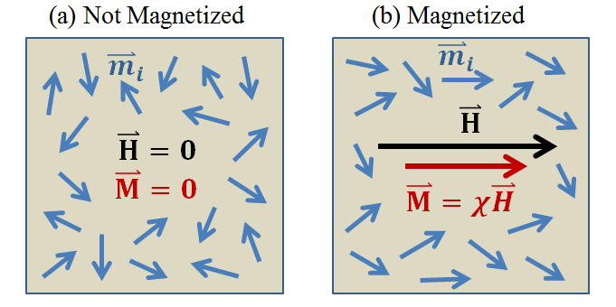

.. _magnetic_permeability_magnetism:

Magnetism in Rocks
==================

The magnetic permeability of a rock is determined by the nature of induced magnetization it experiences in response to an applied magnetic field.
Here, we define induced magnetization by considering a collection of magnetic dipole moments.
A mathematical relationship between induced magnetization and the magnetic permeability is then presented.

Theory of Magnetism
-------------------

Magnetism is attributed to the movement of electrical charges.
Within a material, the motion and spin of individual electrons is responsible for generating a collection of magnetic moments :math:`\{{\bf m_i}\}`.
The total magnetic moment for the material :math:`{\bf m}`, is equal to the vector sum of all electron magnetic moments:

.. math::
	{\bf m} = \sum_i {\bf m_i}
	:label: Sum_Dipoles
	
Magnetization :math:`{\bf M}` is defined as the magnetic moment per unit volume:

.. math::
	{\bf M} = \frac{d {\bf m}}{d V}
	:label: Mag_Definition

The majority of rocks are paramagnetic.
In the absence of a magnetic field, magnetic moments within paramagnetic rocks are frequently disordered.
In this case, individual magnetic moments cancel out one another, resulting in a net magnetization of zero.
When exposed to a magnetic field, the magnetic moments within paramagnetic rocks experience a torque.
This torque attempts to align individual magnetic moments along the direction of the field.
As a result, the rock experiences a net magnetization parallel to the applied field.
This process is illustrated in Figure (needs reference).

        
        Magnetization :math:`{\bf M}` in matter, as represented by the partial alignment of magnetic dipole moments :math:`{\bf m_i}` in response to an applied magnetic field :math:`{\bf H}`.

Magnetic susceptibility is defined as the ratio between induced magnetization and the strength of an applied magnetic field.
Provided the magnetic field is not too strong, this relationship is linear:

.. math::
	{\bf M} = \chi {\bf H}
	:label: Const_Rel_Mag

where :math:`\chi` is magnetic susceptibility of the rock, :math:`{\bf H}` is the magnetic field intensity, and :math:`{\bf M}` is the induced magnetization.
Because the majority of rocks are paramagnetic, they are almost always characterized by magnetic susceptibilities greater than 0.
However, some rocks are diamagnetic, an experience induced magnetizations which opposed the applied magnetic field.
These rocks are characterized by magnetic susceptibilities less than 0.

Relationship Between Magnetization and Magnetic Permeability
------------------------------------------------------------

According to the magnetic constitutive relationship (link), the relationship between magnetic susceptibiliy and magnetic permeability (link), and Eq. :eq:`Const_Rel_Mag`:

.. math::
	{\bf B} = \mu {\bf H} = \mu_0 \big [1 +\chi \, ] {\bf H} = \mu_0 \big [ {\bf H + M} \big ]
	:label: Rel_BMH

where :math:`\mu_0 = 4\pi \times 10^{-7}` H/m is the permeability of free-space.
Eq. :eq:`Rel_BMH` implies that induced magnetization contributes towards the net magnetic flux density within the rock.
Furthermore, the nature of this contribution may be represented by the rock's magnetic permeability.

References:

Griffiths, David J., "Introduction to Electrodynamics", 3rd Ed., Prentice Hall, 1999.

